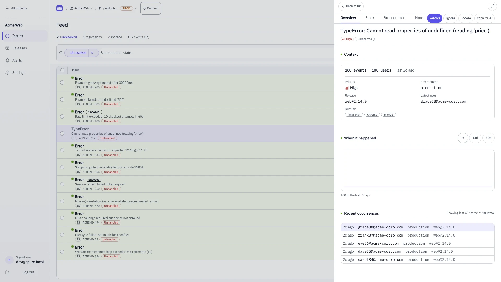
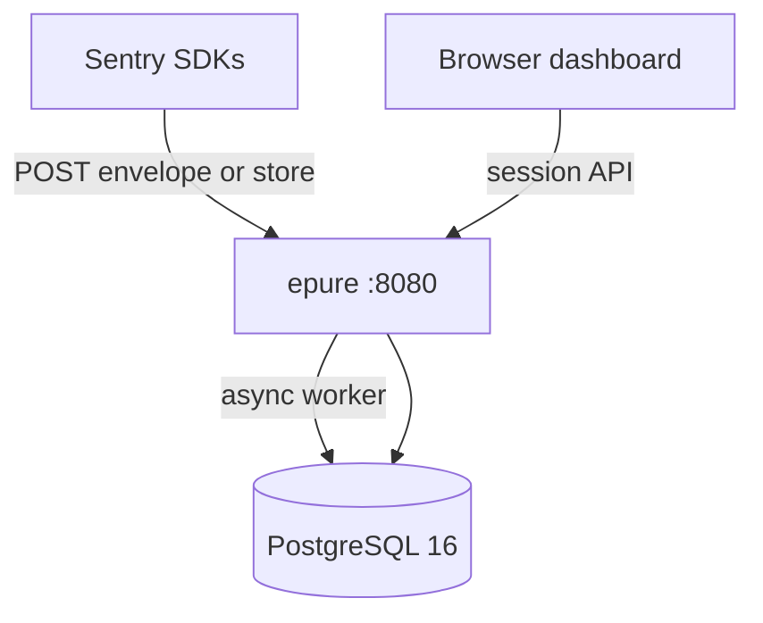

# Error tracking without the noise

[Docs](docs/README.md) · [Quickstart](docs/QUICKSTART.md) · [Issues](https://github.com/epure-sh/epure/issues)

[](LICENSE)
[](docker-compose.yml)
[](crates/)

When production throws, you get a grouped issue with a stack you can read. Essentials only — no alert fatigue.

**Exception-only error monitoring.** Keep your `@sentry/*` SDKs; change the DSN. Two containers (~82 MiB idle), PostgreSQL RLS, spike valve. Not an observability suite — no APM, replay, profiling, or session replay.

- **~82 MiB idle** — Rust + PostgreSQL 16 (Docker Desktop, 2026-09-12)
- **9 s to first issue** — cached images, fresh volume: compose → login → envelope → grouped row
- **Change the DSN only** — official `@sentry/*` SDKs via envelope and store; CORS for browser
- **Spike valve** — runaway fingerprints bump counters, not duplicate event bodies
- **Keyboard triage** — `j`/`k` move, `e` resolve, `i` ignore



## Quick start

```bash
git clone https://github.com/epure-sh/epure.git && cd epure
docker compose up --build
curl -sS http://localhost:8080/health   # → {"status":"ok"}
```

Open http://localhost:8080, register, create a DSN (Settings → DSN keys), point your SDK. Warm stack: issue visible in **~2 s** after ingest (2026-09-12). [Full path →](docs/QUICKSTART.md) · [Production →](docs/SELF_HOST.md)

## Point your SDK

Change `dsn` only:

```javascript
import * as Sentry from "@sentry/browser";

Sentry.init({
  dsn: "http://{public_key}@localhost:8080/{project_id}",
  tracesSampleRate: 0, // transactions discarded in Phase 1
});
```

Revoked keys → **403**. Default cap: **5000 events/hour** per project. HTTP localhost: `EPURE_SESSION_SECURE=0`. [Migrate from Sentry →](docs/MIGRATION.md)

## Security & privacy

| | |
|---|---|
| **License** | [Apache 2.0](LICENSE), full OSS core |
| **Telemetry** | No phone-home; your data stays on your Postgres volume |
| **Tenancy** | PostgreSQL RLS (`app.current_org_id`) on dashboard APIs |
| **PII** | Regex scrub at ingest; see [DATA.md](DATA.md) |
| **Vulnerabilities** | [SECURITY.md](SECURITY.md) (GitHub private advisory) |

## Compatibility (honest)

**Not 100% Sentry parity.** Phase 1: exception ingest, JS/TS sourcemaps, breadcrumbs, releases, alerts, webhooks. Out: transactions, replay, profiling, sessions, mobile symbolication.

| Language | SDK (fixture) | Ingest E2E | Sourcemaps |
|---|---|---|---|
| Browser (JS) | `@sentry/browser` 7.120.0 | ✓ CI | demangle |
| Node.js | `@sentry/node` 7.120.0 | Fixture captured¹ | demangle |
| Python | store fixture | ✓ CI | raw frames |
| Go / Ruby / PHP / Java / .NET | real SDK dumps on disk | Fixture captured¹ | raw frames |

¹ Node + five others: real SDK envelopes on disk; HTTP ingest not in CI yet (browser + Python store are E2E). [Full matrix →](docs/COMPATIBILITY.md)

<details>
<summary><strong>How epure compares</strong></summary>

Measured epure figures from this repo (2026-09-12). Competitor figures from their documentation as of 2026-09. Re-verify before you rely on them.

| | **epure** | **Sentry self-host** | **GlitchTip** |
|---|---|---|---|
| **Containers / services** | 2 (app + Postgres) | 20+ services typical ([docs](https://develop.sentry.dev/self-hosted/)) | 4+ (web, worker, Postgres, Valkey) ([install](https://glitchtip.com/documentation/install)) |
| **RAM (published minimum)** | **~82 MiB** idle (measured) | 16 GB + 16 GB swap ([self-hosted guide](https://develop.sentry.dev/self-hosted/)) | 512 MB recommended / 256 MB min ([install](https://glitchtip.com/documentation/install)) |
| **SDK migration** | Change DSN | Change DSN | Change DSN |
| **License** | Apache 2.0 | BSL / SaaS | MIT |

Full comparison and FAQ: [docs/COMPATIBILITY.md](docs/COMPATIBILITY.md). Architecture: [docs/ARCHITECTURE.md](docs/ARCHITECTURE.md).

</details>

<details>
<summary><strong>Deploy topology</strong></summary>

Two containers. No Redis or Kafka on the core path.



**Plain text:** SDKs POST to `epure` on port 8080. The Rust binary accepts ingest, runs demangle/scrub/group in a worker, and persists to PostgreSQL 16. The embedded SPA reads issues through RLS-scoped APIs on the same port.

| Service | Port | Role |
|---|---|---|
| `epure` | `8080` | Rust binary (`--mode=all`) + embedded dashboard SPA |
| `postgres` | `5433` → `5432` | PostgreSQL 16 with RLS and partitioned events |

</details>

<details>
<summary><strong>Dev seed (⚠️ DEV ONLY)</strong></summary>

Optional smoke data — do not use these credentials in production:

```bash
./scripts/seed-dev.sh
```

⚠️ DEV ONLY login: `dev@epure.local` / `devpassword`

| Field | Value |
|---|---|
| Project ID | `550e8400-e29b-41d4-a716-446655440000` |
| Public key | `a1b2c3d4e5f6g7h8i9j0` |
| Secret | `supersecretdevkey` |

Envelope smoke test and curl blocks: [docs/QUICKSTART.md](docs/QUICKSTART.md).

</details>

<details>
<summary><strong>Heavy seed (dashboard UX)</strong></summary>

50+ issues, ~1k events, alerts, regressions across three projects:

```bash
./scripts/seed-heavy.sh
```

Requires `python3` and a running `epure` container. Re-run anytime — resets seeded issues/events only.

</details>

<details>
<summary><strong>Admin &amp; settings (S6)</strong></summary>

- **Projects** — retention 14 / 30 / 90 days; per-project ingest cap (default 5000/hr)
- **DSN keys** — create, rotate, revoke (revoked → **403** on ingest)
- **Team** — email invites; Google OAuth when `GOOGLE_CLIENT_ID` is set
- **RBAC** — Owner / Admin / Member; environment filter (`production` / `staging` / `local`)

Operator checklist: [docs/SELF_HOST.md](docs/SELF_HOST.md).

</details>

<details>
<summary><strong>Tests &amp; contributing</strong></summary>

Integration tests expect Postgres on host port **5433**:

```bash
./scripts/test.sh
```

Scope, PR workflow, and slice proofs: [CONTRIBUTING.md](CONTRIBUTING.md). Release notes: [CHANGELOG.md](CHANGELOG.md).

</details>

---

**Managed hosting:** [epure Cloud](https://epure.sh) — Pro $24/mo · Plus $79/mo. Flat pricing, no per-event overage.
