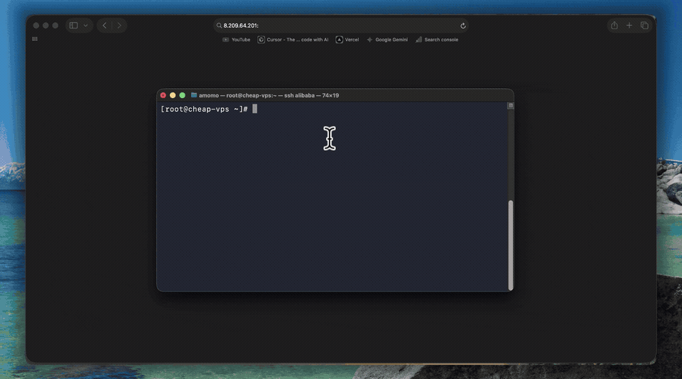
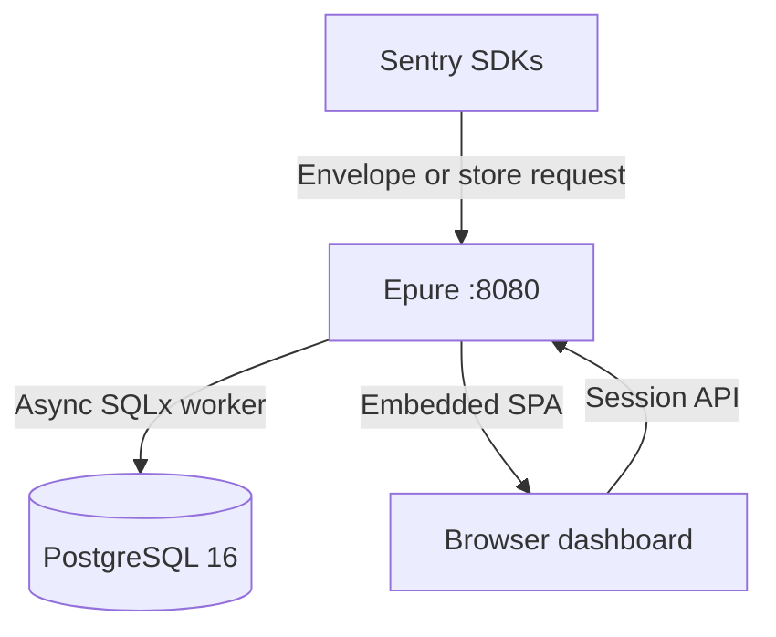

<p align="center">
  
</p>

<p align="center">
  <a href="https://github.com/epure-sh/epure/actions/workflows/ci.yml">
    
  </a>
  <a href="https://github.com/epure-sh/epure/actions/workflows/image.yml">
    
  </a>
  <a href="LICENSE">
    
  </a>
  <a href="https://www.rust-lang.org/">
    
  </a>
  <a href="https://www.postgresql.org/">
    
  </a>
  <a href="https://github.com/epure-sh/epure/pkgs/container/epure">
    
  </a>
</p>

# Epure

**Lightweight, exception-only error tracking for solo founders and small teams.**

Keep your official Sentry SDK. Change the DSN. When production breaks, Epure gives you a grouped issue, readable stack trace, breadcrumbs, and release context without requiring Kafka, Redis, or ClickHouse.

Self-host it with Docker Compose, or use Epure Cloud when you no longer want to operate it yourself.

> Epure is focused error tracking, not a complete observability platform. It deliberately does not provide distributed tracing, session replay, continuous profiling, or generic log ingestion.



## Try it in one minute

### Requirements

- Docker Engine
- Docker Compose v2
- Ports `8080` and `5433` available by default

Clone the repository and start Epure:

```bash
git clone https://github.com/epure-sh/epure.git
cd epure
docker compose up -d
```

Check that the application is healthy:

```bash
curl -sS http://localhost:8080/health
```

Expected response:

```json
{"status":"ok"}
```

Open [http://localhost:8080](http://localhost:8080), create an account, create a project, and copy the generated DSN.

### Send a test exception

Use the official Sentry SDK for your language and point it at your Epure DSN.

Example with Node.js:

```javascript
import * as Sentry from "@sentry/node";

Sentry.init({
  dsn: process.env.SENTRY_DSN,
  tracesSampleRate: 0,
  profilesSampleRate: 0,
});

Sentry.captureException(new Error("Epure test event"));
```

After the event is sent, open the Epure dashboard. You should see a grouped issue with its stack trace.

For production setup, environment variables, reverse proxies, backups, and upgrades, see the [self-hosting documentation](https://epure.sh/docs/self-hosting/installation).

## Why Epure exists

Sentry is a good fit when you need a broad observability platform. Epure is for a smaller and more specific use case:

- You run a SaaS, side project, internal tool, or small startup.
- You want to know when production throws an exception.
- You want readable stack traces and grouped issues.
- You run on a VPS or small cloud instance.
- You do not want to operate a large observability stack.
- You do not want an unexpected bill when one bug enters an infinite loop.

Epure is intentionally narrow:

> **Production exceptions → grouped issues → calm triage.**

If you need tracing, replay, profiling, logs, or advanced infrastructure metrics, Epure may not be the right tool.

## Features

- Official Sentry SDK ingestion through envelope and store endpoints.
- Grouped issues with breadcrumbs and readable stack traces.
- JavaScript and TypeScript sourcemap support.
- Releases and regression detection.
- Alerts and webhooks.
- Multi-project organizations.
- DSN rotation and revocation.
- Role-based access control.
- PostgreSQL row-level security.
- Keyboard-first issue triage.
- Markdown export for debugging and AI-assisted analysis.
- Spike protection for duplicate-event floods.
- Two-container Docker Compose deployment.
- No Redis, Kafka, ClickHouse, or separate worker container.

## Use the official Sentry SDKs

Epure does not require a custom client SDK.

Configure the official Sentry SDK for your language and point its DSN to your Epure project:

```javascript
import * as Sentry from "@sentry/browser";

Sentry.init({
  dsn: "http://{public_key}@localhost:8080/{project_id}",
  tracesSampleRate: 0,
  replaysSessionSampleRate: 0,
  replaysOnErrorSampleRate: 0,
  profilesSampleRate: 0,
});
```

The example disables telemetry features that Epure does not currently use. Epure focuses on exception events, stack traces, breadcrumbs, releases, and issue triage.

Epure implements the parts of the Sentry ingestion path required for exception tracking. Compatibility varies by language, SDK version, and feature. Check the support matrix before migrating a production application.

## SDK support

| Platform | Status | Notes |
|---|---|---|
| Browser (`@sentry/browser` 7.x) | E2E in CI | JavaScript and TypeScript sourcemaps |
| Python | E2E in CI | Store endpoint and raw frames |
| Node.js (`@sentry/node` 7.x) | Parse and fixture coverage | JavaScript and TypeScript sourcemaps |
| Go | Fixture captured | Raw frames |
| Ruby | Fixture captured | Raw frames |
| PHP | Fixture captured | Raw frames |
| Java | Fixture captured | Raw frames |
| .NET | Fixture captured | Raw frames |

See the full [platform support matrix](https://epure.sh/docs/platforms).

The ingest contract is available in the repository:

- [Ingest API documentation](https://epure.sh/docs/api)
- [Envelope endpoint](https://epure.sh/docs/api/envelope)
- [OpenAPI specification](docs/ingest.openapi.yaml)

## How it works

Epure uses one Rust application container and one PostgreSQL container.



### Services

| Service | Port | Role |
|---|---|---|
| `epure` | Host `EPURE_PORT` → `8080` | Ingest, API, and embedded dashboard |
| `postgres` | Host `POSTGRES_HOST_PORT` → `5432` | Issues, events, releases, sessions, and RLS |

### Ingestion path

1. The SDK sends an envelope or store request to Epure.
2. Epure authenticates the project through its DSN.
3. The request passes the body-size and spike-protection limits.
4. Epure returns an acknowledgement before durable persistence.
5. The background worker processes sourcemaps, scrubs configured PII, groups events, and writes them to PostgreSQL.
6. The dashboard displays the resulting issue and event data.

### Spike protection

Epure includes a per-fingerprint token bucket to reduce the damage caused by duplicate-event floods.

The current defaults are:

- Approximately `100` events per fingerprint per minute.
- A project-level cap of approximately `5,000` events per hour.
- A `2 MB` request body limit.
- Duplicate bodies may be discarded after the configured threshold while occurrence counts remain visible.

These limits are implementation defaults and may change before the first stable release. See the [configuration documentation](https://epure.sh/docs/self-hosting/configuration).

## Architecture

- Rust application binary.
- PostgreSQL 16.
- SQLx asynchronous database access.
- PostgreSQL row-level security for organization isolation.
- Monthly event partitions.
- Embedded React dashboard using `rust-embed`.
- No Redis.
- No Kafka.
- No ClickHouse.
- No separate worker container.

### Resource usage

Measured with `docker stats` on a 2 vCPU / 769 MiB Linux VPS (Alibaba Cloud) on 2026-09-23, classic Compose (`epure` + `postgres`):

- Idle: Epure approximately `5 MiB` RSS, PostgreSQL approximately `48 MiB` RSS (~`53 MiB` combined).
- Under a short store-ingest burst (~280–330 req/s on that host): Epure stayed under approximately `12 MiB` RSS; PostgreSQL was the heavier of the two (~`70 MiB`).
- Time from a running instance to the first test issue: approximately `10 seconds` (Docker Desktop, 2026-09-20).

An earlier Docker Desktop idle measurement (2026-09-20) showed approximately `50 MiB` RSS for the Epure application container alone. Host OS, Docker runtime, and database state all move these numbers — re-verify on your hardware.

## Comparison

Epure is not intended to replace every error-tracking or observability product.

| | Epure | Sentry self-hosted | GlitchTip |
|---|---|---|---|
| Primary focus | Exception tracking | Broad observability | Error tracking and performance monitoring |
| Deployment | Two-container Compose stack | Large multi-service deployment | Multiple deployment options |
| SDK path | Change the DSN | Change the DSN | Change the DSN |
| Database | PostgreSQL | Several services depending on configuration | PostgreSQL |
| License | Apache 2.0 | Check the current Sentry license | MIT |
| Best fit | Indie SaaS, small teams, homelabs | Teams needing a broad platform | Teams wanting a Sentry-compatible alternative |

Resource requirements and deployment layouts vary by version and configuration. Check each project’s current documentation before comparing installations.

If GlitchTip already works well for you, you should keep using it. Epure is aimed at people who want a smaller, more focused stack.

## Out of scope

The current Phase 1 release does not provide:

- Distributed tracing.
- Session replay.
- Continuous profiling.
- Generic log ingestion.
- Infrastructure metrics.
- iOS or Android symbolication.
- Redis, Kafka, or ClickHouse integrations.
- Full 1:1 Sentry protocol compatibility.
- High-volume analytics for large observability deployments.

Epure is designed for focused application exception tracking. Its scope may expand over time, but it will not try to become every observability product at once.

## Configuration

The default setup requires no `.env` file.

To change the application port:

```bash
cp .env.example .env
```

Edit:

```env
EPURE_PORT=3000
```

Then recreate the application container:

```bash
docker compose up -d
```

For development data and local frontend work:

```bash
./configure --dev
```

For a production-oriented configuration:

```bash
./configure --prod
```

Read the complete [configuration reference](https://epure.sh/docs/self-hosting/configuration).

## Production considerations

Before using Epure for important production workloads:

- Put Epure behind HTTPS.
- Restrict PostgreSQL access to the internal Docker network.
- Configure persistent volumes.
- Back up PostgreSQL regularly.
- Test restoring a backup.
- Pin a known Epure release rather than deploying an untested development commit.
- Monitor disk usage and database growth.
- Review retention and event-limit settings.
- Test your SDK and application error paths.
- Read the upgrade notes before updating.
- Do not expose the PostgreSQL port publicly unless you have a specific reason.

Epure is an early project. It is suitable for experiments, homelabs, side projects, and small deployments where you have tested your own backup and upgrade process.

## Project status

Epure is in an early release.

The core self-hosted workflow is available:

- Start the stack.
- Create a project.
- Configure an official Sentry SDK.
- Capture exceptions.
- Group issues.
- Inspect stack traces.
- Configure alerts and releases.

Expect protocol gaps, incomplete SDK coverage, and occasional breaking changes between minor releases. Pin an image tag in production (`EPURE_IMAGE=ghcr.io/epure-sh/epure:v1.1.0`).

If you find a compatibility problem, please include:

- Language and SDK name.
- SDK version.
- Epure version.
- Relevant initialization code.
- A sanitized event payload or reproduction.
- Logs from the Epure container.

## Documentation

- [Epure documentation](https://epure.sh/docs)
- [Quickstart](https://epure.sh/docs/get-started/quickstart)
- [Concepts](https://epure.sh/docs/get-started/concepts)
- [Self-hosting installation](https://epure.sh/docs/self-hosting/installation)
- [Configuration](https://epure.sh/docs/self-hosting/configuration)
- [Platform support](https://epure.sh/docs/platforms)
- [Ingest API](https://epure.sh/docs/api)
- [Envelope endpoint](https://epure.sh/docs/api/envelope)

## Community and support

- [SUPPORT.md](SUPPORT.md) — which channel to use.
- [GitHub Discussions](https://github.com/epure-sh/epure/discussions) — setup questions and usage discussions.
- [GitHub Issues](https://github.com/epure-sh/epure/issues) — bugs and SDK compatibility problems.
- [Security policy](SECURITY.md) — private vulnerability reports.
- [Contributing guide](CONTRIBUTING.md) — development setup and pull requests.
- [Changelog](CHANGELOG.md) — release history.
- [docs/](docs/README.md) — OpenAPI + links to the full site docs.

## Contributing

Contributions are welcome.

Before opening a pull request:

1. Read [CONTRIBUTING.md](CONTRIBUTING.md).
2. Search existing issues and discussions.
3. Add or update tests where appropriate.
4. Document compatibility or migration changes.
5. Explain the user problem your change solves.

Useful contribution areas include:

- SDK compatibility.
- Sourcemap support.
- Documentation.
- Deployment guides.
- Backup and migration tooling.
- Performance benchmarks.
- Accessibility.
- Dashboard improvements.

## License

Epure is licensed under the [Apache License 2.0](LICENSE).

There is no separate `ee/` directory or closed-source core.
