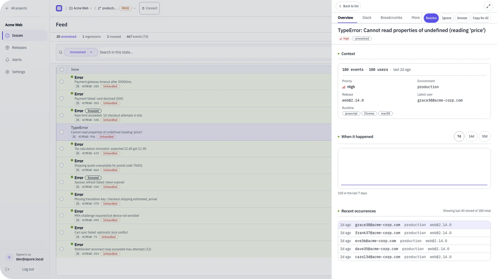
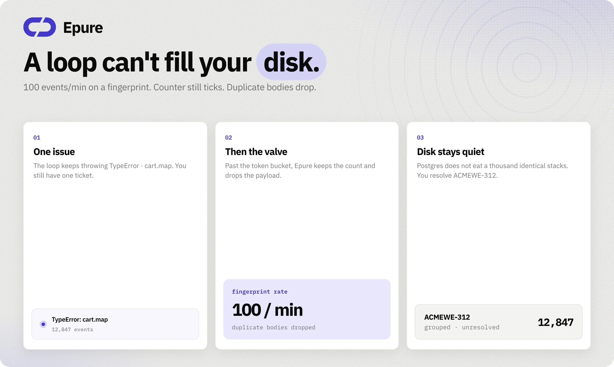

<div align="center">
  
</div>

<br />

<div align="center">

**Error tracking without the noise.**

Exception-only monitoring. Keep your official `@sentry/*` SDKs. Change the DSN.

When production throws, you get a grouped issue and a stack you can read.

<br />

[Website](https://epure.sh)
&nbsp;·&nbsp;
[Docs](https://epure.sh/docs)
&nbsp;·&nbsp;
[Quickstart](docs/QUICKSTART.md)
&nbsp;·&nbsp;
[Self-host](docs/SELF_HOST.md)
&nbsp;·&nbsp;
[Issues](https://github.com/epure-sh/epure/issues)

<br />

[](LICENSE)
[](docker-compose.yml)
[](crates/)
[](https://github.com/epure-sh/epure/actions/workflows/ci.yml)

</div>

<br />

<div align="center">
  
</div>

<br />

| | | | |
|:---:|:---:|:---:|:---:|
| **2 containers** | **~82 MiB** idle | **~9 s** to first issue | **`j` `k` `e` `i`** |

<sub>Idle stack and 9 s path measured 2026-09-12 on Docker Desktop. Re-verify on your hardware.</sub>

## Quick start

Docker Compose v2. From a clone:

```bash
git clone https://github.com/epure-sh/epure.git && cd epure
docker compose up --build
curl -sS http://localhost:8080/health   # → {"status":"ok"}
```

Open [http://localhost:8080](http://localhost:8080) → register → **Settings → DSN keys** → create a key → point your SDK.

Cached images: about **9 s** to a healthy stack. First no-cache build is slower (~160 s, once). Warm ingest → visible issue: about **2 s**.

Production overlay, TLS, backups: [docs/SELF_HOST.md](docs/SELF_HOST.md). Timed walkthrough: [docs/QUICKSTART.md](docs/QUICKSTART.md).

<details>
<summary>Dev seed (skip register)</summary>

```bash
./scripts/seed-dev.sh
# login: dev@epure.local / devpassword   ⚠️ DEV ONLY
```

Needs compose already up. Creates org, project, DSN, and a dashboard user.

</details>

## Point the DSN

No `@epure/*` package. Same client you already ship.

```javascript
import * as Sentry from "@sentry/browser";

Sentry.init({
  dsn: "http://{public_key}@localhost:8080/{project_id}",
  tracesSampleRate: 0,
  replaysSessionSampleRate: 0,
  replaysOnErrorSampleRate: 0,
  profilesSampleRate: 0,
});
```

Zero the extra product lines so transactions, replay, and profiles are discarded without surprise. JS/TS sourcemaps demangle. Other languages keep raw frames.

Revoked keys → **403**. Default ingest cap: **5000 events/hour** per project. Localhost HTTP: `EPURE_SESSION_SECURE=0` (compose default).

Coming from Sentry SaaS? Change the DSN, trim sample rates, re-upload maps. History does not import. Rollback is the old DSN. [docs/MIGRATION.md](docs/MIGRATION.md) · [docs/COMPATIBILITY.md](docs/COMPATIBILITY.md)

## What you get

- [x] **Envelope + store ingest** — official Sentry SDKs via DSN
- [x] **Grouped issues** — fingerprint, resolve once
- [x] **Breadcrumbs** — clicks, HTTP, console with the event
- [x] **Spike valve** — loop bumps the counter; duplicate bodies drop
- [x] **Keyboard triage** — `j` / `k` move, `e` resolve, `i` ignore · `Cmd+Shift+C` copies Markdown for an LLM
- [x] **Alerts + webhooks** — regression, velocity, snooze · Slack / Discord / POST
- [x] **Releases** — deploy-aware issues · JS/TS maps per release
- [x] **Your Postgres** — RLS on dashboard APIs · volume stays on your box

Two containers: Rust binary + PostgreSQL 16. No Redis. No Kafka.

<details>
<summary>Spike valve (why loops do not fill the disk)</summary>

<br />

<div align="center">
  
</div>

<br />

Past the token bucket, Epure keeps incrementing the issue and stops storing identical payloads. You see **12,847 events**. You do not store 12,847 copies of the same stack.

Ingest / worker / RLS: [docs/ARCHITECTURE.md](docs/ARCHITECTURE.md).

</details>

## What this is not

Exception monitoring. That is the product.

Out of scope on purpose: distributed tracing, session replay, continuous profiling, generic log ingest, iOS/Android symbolication. If the SDK sends those, the HTTP request is accepted and those items are dropped.

If replay and APM are how you debug, keep Sentry. Matrix with citations: [docs/COMPATIBILITY.md](docs/COMPATIBILITY.md).

<details>
<summary>How Epure compares</summary>

<br />

Measured Epure figures from this repo (2026-09-12). Competitor figures from their documentation as of 2026-09. Re-verify before you rely on them.

| | **Epure** | **Sentry self-host** | **GlitchTip** |
|---|---|---|---|
| **Containers / services** | 2 (app + Postgres) | 20+ services typical ([docs](https://develop.sentry.dev/self-hosted/)) | 4+ (web, worker, Postgres, Valkey) ([install](https://glitchtip.com/documentation/install)) |
| **RAM (published minimum)** | **~82 MiB** idle (measured) | 16 GB + 16 GB swap ([self-hosted guide](https://develop.sentry.dev/self-hosted/)) | 512 MB recommended / 256 MB min ([install](https://glitchtip.com/documentation/install)) |
| **SDK migration** | Change DSN | Change DSN | Change DSN |
| **License** | Apache 2.0 | BSL / SaaS | MIT |

If GlitchTip is already quiet for you, stay there. Epure is for fewer moving parts on a small VPS.

</details>

## Docs

| When | Open |
|---|---|
| First issue, timed steps | [docs/QUICKSTART.md](docs/QUICKSTART.md) |
| Cut over from Sentry | [docs/MIGRATION.md](docs/MIGRATION.md) |
| Production box | [docs/SELF_HOST.md](docs/SELF_HOST.md) |
| “Does my SDK work?” | [docs/COMPATIBILITY.md](docs/COMPATIBILITY.md) |
| How ingest and RLS work | [docs/ARCHITECTURE.md](docs/ARCHITECTURE.md) |
| PII, retention, RBAC | [DATA.md](DATA.md) |
| Patch / test / PR | [CONTRIBUTING.md](CONTRIBUTING.md) |

<details>
<summary>First-hour troubleshooting</summary>

<br />

| You see | Try this |
|---|---|
| `Connection refused` on `:8080` | `docker compose ps` and `docker compose logs epure`. Wait until healthy. |
| Health is not `{"status":"ok"}` | Migrations may still be running. Wait ~10 s. Check logs for SQL errors. |
| Ingest **202** but no issue | Worker batches ~500 ms. Refresh once. Then `docker compose logs epure`. |
| Login bounces you back | HTTP localhost needs `EPURE_SESSION_SECURE=0` (compose default). |
| Browser SDK blocked by CORS | Add the frontend origin to `EPURE_CORS_ORIGINS`. |
| Ingest **403** | Key missing or revoked. Settings → DSN keys, or re-run the dev seed. |

Ten-row table plus curl blocks: [docs/QUICKSTART.md](docs/QUICKSTART.md#troubleshooting).

</details>

<details>
<summary>FAQ</summary>

<br />

**Do I need a new SDK?**  
No. Official Sentry clients. Change `dsn`.

**Will my old Sentry issues show up?**  
No. New events only. Keep the old DSN until you are happy, then swap.

**Can I run this on a $4 VPS?**  
That is the point of two containers. Re-measure RAM on your box. We saw ~82 MiB idle on Docker Desktop (2026-09-12).

**Browser + Python?**  
Those ingest paths are E2E in CI. Node and the other language dumps are real SDK fixtures on disk. File a [compat issue](https://github.com/epure-sh/epure/issues/new?template=02-compat.yml) if yours fails.

**Can I send a PR for tracing?**  
Not for this tree. Scope is in [ROADMAP.md](ROADMAP.md) and [CONTRIBUTING.md](CONTRIBUTING.md).

</details>

## Community

| Best for | Where |
|---|---|
| Bugs & SDK gaps | [GitHub Issues](https://github.com/epure-sh/epure/issues) |
| Setup questions | [Discussions](https://github.com/epure-sh/epure/discussions) |
| Security | [SECURITY.md](SECURITY.md) · `security@news.epure.sh` |
| Support | [SUPPORT.md](SUPPORT.md) · `support@news.epure.sh` |
| Conduct | [CODE_OF_CONDUCT.md](CODE_OF_CONDUCT.md) |

---

**Apache 2.0** · no `ee/` split · Copyright 2026 Epure contributors

**Managed hosting:** Epure Cloud — Pro $24/mo · Plus $79/mo. Flat pricing, no per-event overage. [epure.sh](https://epure.sh)
