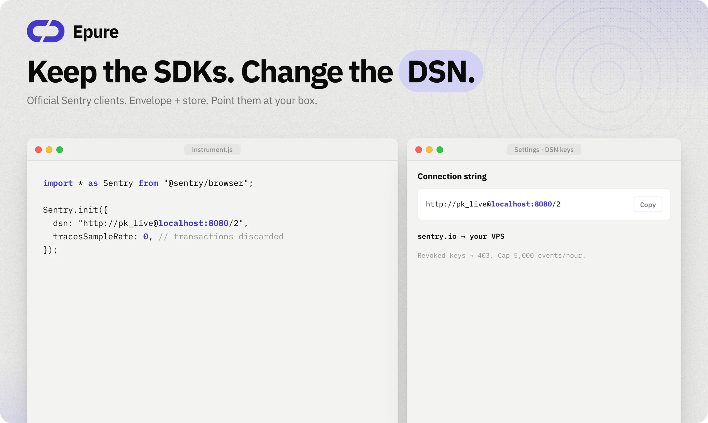
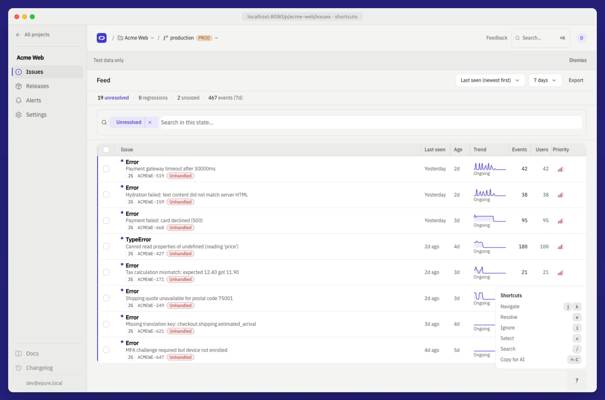

<div align="center">
  
</div>

<br />

<div align="center">
  <strong>Error tracking without the bloat.</strong>
  <br />
  Keep your official Sentry SDKs. Change the DSN.
  <br /><br />
  When production throws, you get a grouped issue and a stack you can read.
  <br /><br />
  <a href="https://epure.sh">Website</a>
  &nbsp;·&nbsp;
  <a href="https://epure.sh/docs">Docs</a>
  &nbsp;·&nbsp;
  <a href="docs/QUICKSTART.md">Quickstart</a>
  &nbsp;·&nbsp;
  <a href="docs/SELF_HOST.md">Self-host</a>
  &nbsp;·&nbsp;
  <a href="https://github.com/epure-sh/epure/issues">Issues</a>
  <br /><br />
  <a href="LICENSE"></a>
  &nbsp;
  <a href="docker-compose.yml"></a>
  &nbsp;
  <a href="crates/"></a>
  &nbsp;
  <a href="https://github.com/epure-sh/epure/actions/workflows/ci.yml"></a>
</div>

<br />

<div align="center">
  
</div>

<br />

<div align="center">
  <strong>2 containers</strong>
  &nbsp;·&nbsp;
  <strong>~82&nbsp;MiB</strong> idle
  &nbsp;·&nbsp;
  <strong>9&nbsp;s</strong> to first issue
  &nbsp;·&nbsp;
  <strong>j / k / e / i</strong>
  <br />
  <sub>Idle stack and 9 s path measured 2026-09-12 on Docker Desktop. Re-verify on your hardware.</sub>
</div>

<br />

<h2 align="center">Why this exists</h2>

<p align="center">I needed grouped production exceptions on a small VPS, and I wanted to keep the official Sentry SDKs. Self-hosted Sentry compose is a fleet. I wanted a stack I could read.</p>

<p align="center">If GlitchTip is already quiet for you, stay there. I built this for fewer moving parts: one Rust binary, PostgreSQL 16, two containers. No Redis. No Kafka.</p>

<br />

<h2 align="center">How it works</h2>

<p align="center">Three steps. You already know the SDK.</p>

| | | |
|:---:|:---|:---|
| **1** | **Connect** | Keep `@sentry/*`. Create a DSN in Settings. Paste it. |
| **2** | **Capture** | Envelope + store ingest. Exceptions group by fingerprint. Breadcrumbs travel with the event. |
| **3** | **Triage** | `j` / `k` move. `e` resolve. `i` ignore. Copy Markdown for an LLM with `Cmd+Shift+C`. |

<br />

<h2 align="center">Get a first issue on screen</h2>

<p align="center">Docker Compose v2. Leave this running in one terminal.</p>

**1. Clone**

```bash
git clone https://github.com/epure-sh/epure.git && cd epure
```

**2. Start**

```bash
docker compose up --build
```

Cached images: about **9 s** to a healthy stack. First no-cache build is slower (about **160 s**, one time).

**3. Check health**

```bash
curl -sS http://localhost:8080/health   # → {"status":"ok"}
```

**4. Open the app**

[http://localhost:8080](http://localhost:8080) → register → **Settings → DSN keys** → create a key.

**5. Throw something**

Paste your project id and keys from Settings → DSN keys:

```bash
PROJECT_ID="{project_id}"
PUBLIC="{public_key}"
SECRET="{secret_key}"

ENVELOPE=$'{"event_id":"'$(uuidgen | tr '[:upper:]' '[:lower:]')'","sdk":{"name":"sentry.test"}}\n{"type":"event","length":120}\n{"exception":{"values":[{"type":"Error","value":"test crash"}]},"platform":"javascript","environment":"local"}\n'

curl -sS -w "\nHTTP %{http_code}\n" \
  -X POST "http://localhost:8080/api/${PROJECT_ID}/envelope/" \
  -H "Content-Type: application/x-sentry-envelope" \
  -H "X-Sentry-Auth: Sentry sentry_version=7, sentry_key=${PUBLIC}, sentry_secret=${SECRET}" \
  --data-binary "$ENVELOPE"
```

Expect **HTTP 202**. The Issues list should show a grouped row in about **2 s** on a warm stack. Or skip curl and point a real SDK (next section).

<details>
<summary>Skip the register step (dev seed only)</summary>

<br />

```bash
./scripts/seed-dev.sh
# login: dev@epure.local / devpassword   ⚠️ DEV ONLY
```

That script needs compose already up. It creates an org, project, DSN, and a dashboard user.

</details>

Production overlay, TLS, backups, upgrades: [docs/SELF_HOST.md](docs/SELF_HOST.md). Full timed path: [docs/QUICKSTART.md](docs/QUICKSTART.md).

<br />

<h2 align="center">Point the DSN</h2>

<p align="center">No <code>@epure/*</code> package. Same client you already ship.</p>

<div align="center">
  
</div>

<br />

```javascript
import * as Sentry from "@sentry/browser";

Sentry.init({
  dsn: "http://{public_key}@localhost:8080/{project_id}",
  tracesSampleRate: 0,
  replaysSessionSampleRate: 0,
  replaysOnErrorSampleRate: 0,
  profilesSampleRate: 0,
});
```

Zero the extra product lines so you are not surprised when transactions, replay, and profiles are discarded. JS/TS sourcemaps demangle. Other languages keep raw frames.

Revoked keys return **403**. Default ingest cap is **5000 events/hour** per project. HTTP on localhost: `EPURE_SESSION_SECURE=0`.

Coming from Sentry SaaS? Change the DSN string, trim sample rates, re-upload maps. History does not import. Rollback is the old DSN. Walkthrough: [docs/MIGRATION.md](docs/MIGRATION.md).

SDK matrix and honest gaps: [docs/COMPATIBILITY.md](docs/COMPATIBILITY.md) · [Platforms](https://epure.sh/docs/platforms).

<br />

<h2 align="center">What you get</h2>

<p align="center">Stacks and breadcrumbs first. The rest is noise control.</p>

| | |
|---|---|
| **Full stacks** | Frames, in-app lines, the one that threw. |
| **Breadcrumbs** | Clicks, HTTP, console. The path to the crash. |
| **Grouping** | Same fingerprint, one issue. Resolve once. |
| **Spike valve** | A retry loop bumps the counter. Duplicate bodies drop. |
| **Keyboard** | `j` `k` `e` `i`. Built for a tired on-call, not a mouse tour. |
| **Alerts + webhooks** | Regression, velocity, snooze. Slack / Discord / generic POST. |
| **Releases** | Tie the issue to the deploy. JS/TS maps per release. |
| **Your Postgres** | RLS on dashboard APIs. Volume stays on your machine. |

<br />

<div align="center">
  
</div>

<br />

<h2 align="center">When a loop hits</h2>

<p align="center">A bad deploy should not fill the disk. You still need the count.</p>

<div align="center">
  
</div>

<br />

The valve watches fingerprint rate. Past the token bucket, Epure keeps incrementing the issue and stops storing identical payloads. You see **12,847 events**. You do not store 12,847 copies of the same stack.

Architecture (ingest, worker, RLS): [docs/ARCHITECTURE.md](docs/ARCHITECTURE.md).

<br />

<h2 align="center">If something is off</h2>

<p align="center">Most first-hour failures are the same five. I wrote these down so you are not grepping logs at 11pm.</p>

| You see | Try this |
|---|---|
| `Connection refused` on `:8080` | `docker compose ps` and `docker compose logs epure`. Wait until the container is healthy. |
| Health is not `{"status":"ok"}` | Migrations may still be running. Wait ~10 s. Check logs for SQL errors. |
| Ingest **202** but no issue | Worker batches ~500 ms. Refresh once. Then `docker compose logs epure`. |
| Login bounces you back | HTTP localhost needs `EPURE_SESSION_SECURE=0` (compose default). |
| Browser SDK blocked by CORS | Add the frontend origin to `EPURE_CORS_ORIGINS`. |
| Ingest **403** | Key missing or revoked. Settings → DSN keys, or re-run the dev seed. |

Ten-row table plus curl blocks: [docs/QUICKSTART.md](docs/QUICKSTART.md#troubleshooting).

Still stuck? Open a [Discussion](https://github.com/epure-sh/epure/discussions) with the `curl` output and `docker compose ps`. I read setup questions. Bugs and SDK gaps: [Issues](https://github.com/epure-sh/epure/issues) (there are templates). Security: [SECURITY.md](SECURITY.md) · `security@news.epure.sh`.

<br />

<h2 align="center">What this is not</h2>

<p align="center">Exception monitoring. That is the product.</p>

Out of scope on purpose: distributed tracing, session replay, continuous profiling, generic log ingest, iOS/Android symbolication. If the SDK sends those, the HTTP request is accepted and those items are dropped.

If replay and APM are how you debug, keep Sentry. Comparison with citations: [docs/COMPATIBILITY.md](docs/COMPATIBILITY.md).

<details>
<summary><strong>How Epure compares</strong></summary>

<br />

Measured Epure figures from this repo (2026-09-12). Competitor figures from their documentation as of 2026-09. Re-verify before you rely on them.

| | **Epure** | **Sentry self-host** | **GlitchTip** |
|---|---|---|---|
| **Containers / services** | 2 (app + Postgres) | 20+ services typical ([docs](https://develop.sentry.dev/self-hosted/)) | 4+ (web, worker, Postgres, Valkey) ([install](https://glitchtip.com/documentation/install)) |
| **RAM (published minimum)** | **~82 MiB** idle (measured) | 16 GB + 16 GB swap ([self-hosted guide](https://develop.sentry.dev/self-hosted/)) | 512 MB recommended / 256 MB min ([install](https://glitchtip.com/documentation/install)) |
| **SDK migration** | Change DSN | Change DSN | Change DSN |
| **License** | Apache 2.0 | BSL / SaaS | MIT |

</details>

<br />

<h2 align="center">Docs I actually use</h2>

| When | Open |
|---|---|
| First issue, timed steps | [docs/QUICKSTART.md](docs/QUICKSTART.md) |
| Cut over from Sentry | [docs/MIGRATION.md](docs/MIGRATION.md) |
| Production box | [docs/SELF_HOST.md](docs/SELF_HOST.md) |
| “Does my SDK work?” | [docs/COMPATIBILITY.md](docs/COMPATIBILITY.md) |
| How ingest and RLS work | [docs/ARCHITECTURE.md](docs/ARCHITECTURE.md) |
| PII, retention, RBAC | [DATA.md](DATA.md) |
| Patch / test / PR | [CONTRIBUTING.md](CONTRIBUTING.md) |

<br />

<details>
<summary><strong>FAQ</strong></summary>

<br />

**Do I need a new SDK?**  
No. Official Sentry clients. Change `dsn`.

**Will my old Sentry issues show up?**  
No. New events only. Keep the old DSN until you are happy, then swap.

**Can I run this on a $4 VPS?**  
That is the point of two containers. Re-measure RAM on your box. We saw ~82 MiB idle on Docker Desktop (2026-09-12).

**Browser + Python?**  
Those ingest paths are E2E in CI. Node and the other language dumps are real SDK fixtures on disk. File a [compat issue](https://github.com/epure-sh/epure/issues/new?template=02-compat.yml) if yours fails.

**Can I send a PR for tracing?**  
Not for this tree. Scope is in [ROADMAP.md](ROADMAP.md) and [CONTRIBUTING.md](CONTRIBUTING.md).

</details>

<br />

<div align="center">
  <sub>
    <a href="LICENSE">Apache 2.0</a>
    · no <code>ee/</code> split
    · <a href="SUPPORT.md">SUPPORT.md</a>
    · <a href="CODE_OF_CONDUCT.md">Conduct</a>
    · <code>support@news.epure.sh</code>
  </sub>
  <br /><br />
  If this got you to a grouped issue, a star is how the next person finds the same path on a Friday night.
</div>
