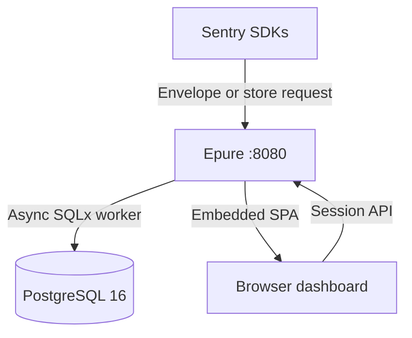

<p align="center">
  
</p>

<p align="center">
  <a href="https://github.com/epure-sh/epure/actions/workflows/ci.yml"></a>
  <a href="https://github.com/epure-sh/epure/actions/workflows/image.yml"></a>
  <a href="https://github.com/epure-sh/epure/releases/latest"></a>
  <a href="LICENSE"></a>
  <a href="https://www.rust-lang.org/"></a>
  <a href="https://www.postgresql.org/"></a>
</p>

# Epure

**Exception-only error tracking you self-host.**

You don't need a 10-node observability cluster to catch a production error. Epure gives you grouped issues, readable stacks, and release context using just one Rust binary and PostgreSQL 16. **No Kafka, no Redis, no ClickHouse.**

| 🪶 Ultra-lightweight | 🔌 Keep Your Sentry SDK | 🤖 Built for AI Agents |
| :--- | :--- | :--- |
| **~53 MiB combined idle footprint.** Runs effortlessly on the smallest VPS you can find. | **Zero code changes.** Keep the official Sentry SDK. Just point your `DSN` to Epure. | **Copy for AI.** Instantly export issue context (stack, breadcrumbs) to Cursor or Claude. |


## 💨 Setup in 15s (on watch)


> **[📖 Read the Full Documentation](https://epure.sh/docs)** — Check out our architecture, deployment guides, and Sentry migration path.


### Everything you can do

<div align="center">

| ⚡ **Run Locally** | 🚀 **Deploy to Prod** | 🔄 **Migrate from Sentry** | 🤖 **Connect to LLM** |
| :---: | :---: | :---: | :---: |
| Install and spin up <br> via Docker in 15 seconds | Everything you need to know <br>to run Epure in production <br>**[check docs](https://epure.sh/docs/self-hosting/installation)** | Swap DSN & zero out tracing <br>**[migration guide](https://epure.sh/docs/guides/migrate-from-sentry)** | AI integration, MCP and CLI <br> **[check docs](https://epure.sh/docs/guides/mcp-and-cli)** |

</div>


## Quickstart

**1. Start it**

```bash
git clone https://github.com/epure-sh/epure.git
cd epure
docker compose up -d
```

**2. Copy the DSN**

Open [http://localhost:8080](http://localhost:8080). Register, create a project, copy the DSN.

**3. Throw one error**

Use the official Sentry SDK, paste the DSN, and set tracing, replay, and profiling to **0**.

```javascript
import * as Sentry from "@sentry/node";

Sentry.init({
  dsn: process.env.SENTRY_DSN, // DSN from step 2
  tracesSampleRate: 0,
  replaysSessionSampleRate: 0,
  replaysOnErrorSampleRate: 0,
  profilesSampleRate: 0,
});

Sentry.captureException(new Error("Epure test event"));
```

**4. Open Issues**

`Epure test event` is on the page. Grouped, with the stack.

Other languages, same DSN: [Pick your SDK](https://epure.sh/docs/platforms). It also lives under **Settings → SDK connection**, and the in-app **Setup** wizard shows it.

## Deploy

**On a VPS**

```bash
./configure --prod
docker compose -f docker-compose.yml -f deploy/docker-compose.prod.yml up -d
```

`./configure --prod` asks for the public HTTPS URL and writes the passwords. Put Caddy, nginx, or Traefik in front of port 8080. Open that URL and repeat steps 2 to 4.

Pin `ghcr.io/epure-sh/epure` to a [release](https://github.com/epure-sh/epure/releases) once the URL is public.

**On a platform**

[](https://render.com/deploy?repo=https://github.com/epure-sh/epure)

| Platform | Start here |
| --- | --- |
| Railway | Drag [`deploy/railway/docker-compose.yml`](deploy/railway/docker-compose.yml) onto the project. [Notes](deploy/railway/README.md). |
| Coolify | Compose, base directory [`deploy/templates/coolify`](deploy/templates/coolify). |
| Dokploy | Compose file [`deploy/templates/dokploy/docker-compose.yml`](deploy/templates/dokploy/docker-compose.yml). |

Then the same steps: register, copy the DSN, throw once, open **Issues**. Longer list: [Installation](https://epure.sh/docs/self-hosting/installation) · [`deploy/`](deploy/README.md).

## Architecture

Ingest acknowledges fast; a background async SQLx worker demangles, scrubs, groups, and writes to Postgres.


```mermaid
graph TD
  SDK[Sentry SDKs] -->|Envelope or store request| EPURE[Epure :8080]
  Browser[Browser dashboard] -->|Session API| EPURE
  EPURE -->|Async SQLx worker| PG[(PostgreSQL 16)]
  EPURE -->|Embedded SPA| Browser

```

---

## 📚 Details & Community

* Grouped issues & readable stack traces
* JS/TS sourcemaps
* Releases and regressions
* Alerts and webhooks
* Multi-project orgs & DSN rotation
* RBAC & PostgreSQL RLS
* Keyboard triage
* Spike protection

Epure is **exception tracking only**. It does not provide distributed tracing, session replay, continuous profiling, generic log ingestion, infrastructure metrics, iOS/Android symbolication, or high-volume analytics stacks.

|  | Epure | Bugsink | Sentry self-hosted | GlitchTip |
| --- | --- | --- | --- | --- |
| **Primary focus** | Exception tracking | Self-hosted error tracking | Broad observability | Error & performance |
| **Deployment** | Two-container Compose | Single-container `docker run` | Large multi-service cluster | Multiple options |
| **License** | Apache 2.0. No `ee/` folder | PolyForm Shield 1.0.0 | Check current Sentry license | MIT |
| **Database** | PostgreSQL 16 | See their docs | Multiple datastores | PostgreSQL |

**Project Status:** Early release. Good for homelabs, side projects, and small teams who have tested backup/upgrade paths. Expect SDK and protocol gaps (please report them!). [Changelog](CHANGELOG.md).

* [Report an Issue](https://github.com/epure-sh/epure/issues)
* [Join Discussions](https://github.com/epure-sh/epure/discussions)
* [Read CONTRIBUTING.md](CONTRIBUTING.md)
* [Security Policy](.github/SECURITY.md)

**License:** [Apache License 2.0](LICENSE). No separate closed-source core.
