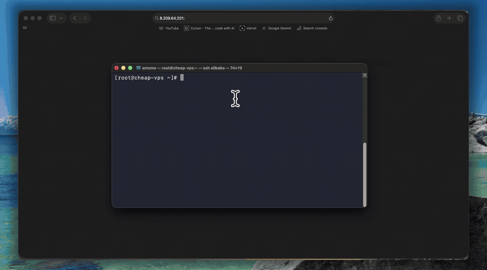
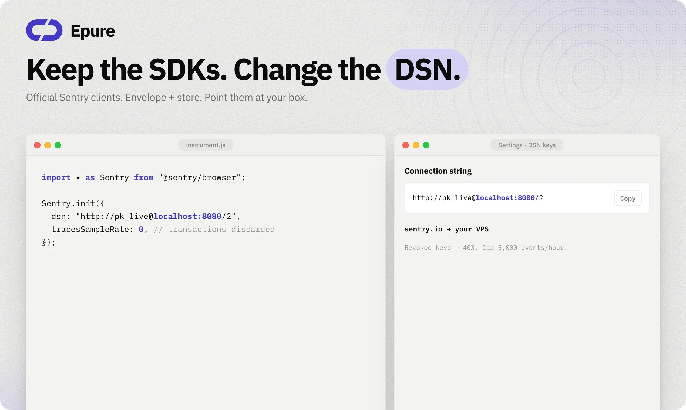
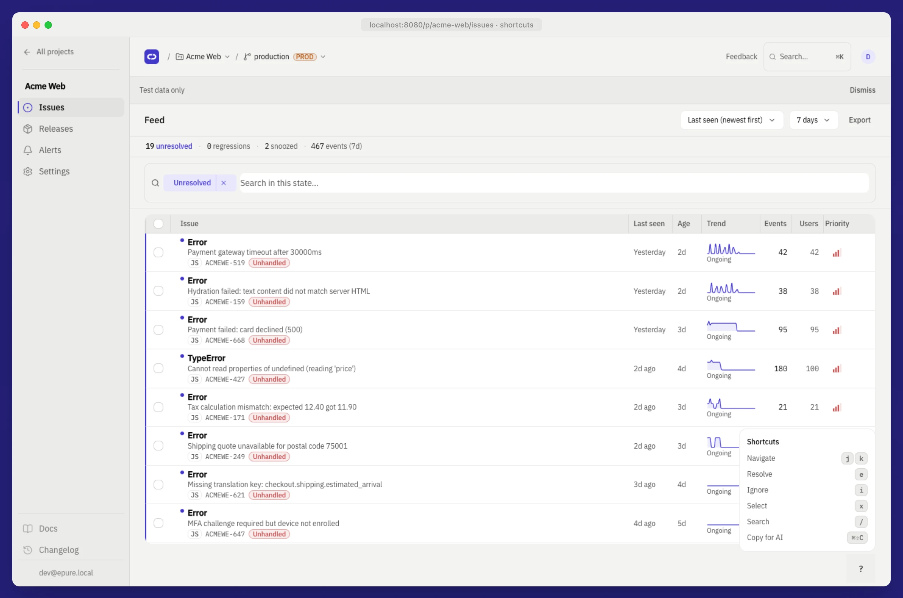
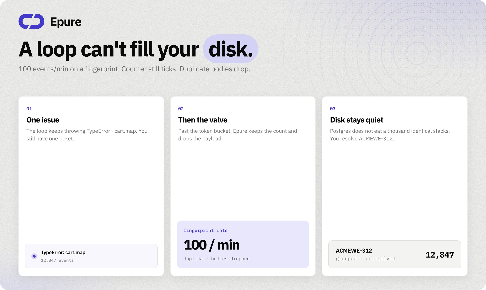
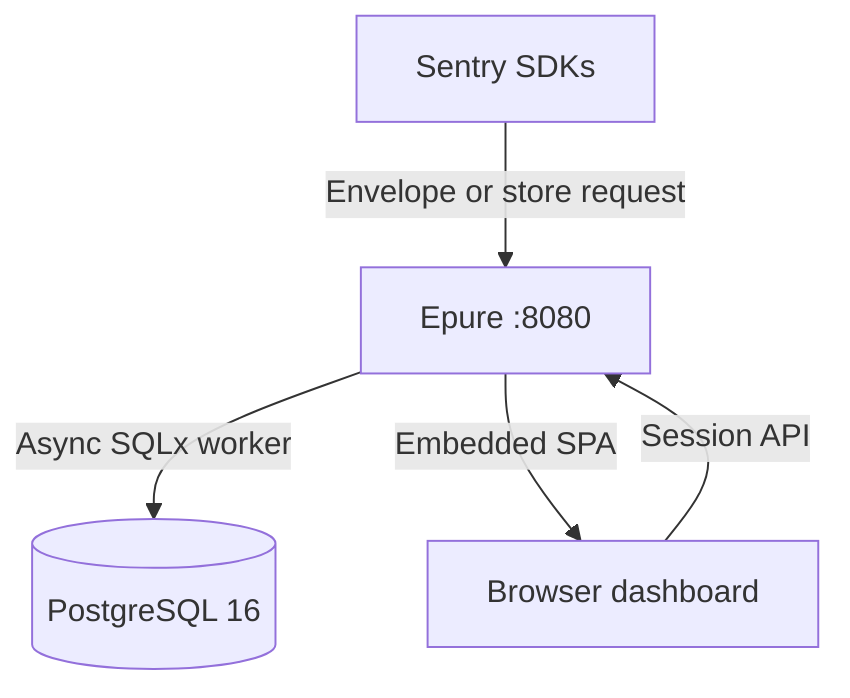

<p align="center">
  
</p>

<p align="center">
  <a href="https://github.com/epure-sh/epure/stargazers">
    
  </a>
  <a href="https://github.com/epure-sh/epure/actions/workflows/ci.yml">
    
  </a>
  <a href="https://github.com/epure-sh/epure/actions/workflows/image.yml">
    
  </a>
  <a href="LICENSE">
    
  </a>
  <a href="https://www.rust-lang.org/">
    
  </a>
  <a href="https://www.postgresql.org/">
    
  </a>
  <a href="https://github.com/epure-sh/epure/pkgs/container/epure">
    
  </a>
</p>

# Epure

**Exception-only error tracking.** Keep your official Sentry SDK and point the DSN at Epure. Self-host with two containers: the app and PostgreSQL 16. [Apache 2.0](LICENSE). There is no `ee/` directory.

When production throws, you get a grouped issue, a readable stack, breadcrumbs, and release context — without Kafka, Redis, or ClickHouse.

**Idle footprint: ~53 MiB combined.** `docker stats` on 2026-09-23, 2 vCPU / 769 MiB Linux VPS (Alibaba Cloud), classic Compose (`epure` + `postgres`): Epure ~5 MiB RSS + PostgreSQL ~48 MiB RSS. [Full notes](#resource-usage).



Animated Issues view ([`.github/readme-shot.gif`](.github/readme-shot.gif), 2.5 MiB). A lighter still of the same screen is [`.github/readme-shot.webp`](.github/readme-shot.webp).

| Point the DSN at Epure | Rotate and revoke keys | Spike protection on an issue |
| --- | --- | --- |
|  |  |  |

## Run it

Docker Engine and Compose v2. No clone and no `.env` file. This downloads the Compose file and pulls `ghcr.io/epure-sh/epure`:

```bash
curl -fsSL https://raw.githubusercontent.com/epure-sh/epure/main/docker-compose.yml -o docker-compose.yml
docker compose up -d
```

Open [http://localhost:8080](http://localhost:8080), create an account, create a project, and copy the DSN.

Pin a release instead of `:latest`:

```bash
EPURE_IMAGE=ghcr.io/epure-sh/epure:v0.1.1 docker compose up -d
```

Defaults: app on host port `8080`, Postgres on host port `5433`. If either is taken, set `EPURE_PORT` and `POSTGRES_HOST_PORT` and run `docker compose up -d` again. Optional health check: `curl -sS http://localhost:8080/health` returns `{"status":"ok"}`.

### From source

```bash
git clone https://github.com/epure-sh/epure.git
cd epure
docker compose up -d
```

Source build overlay: [`deploy/docker-compose.build.yml`](deploy/docker-compose.build.yml).

## Why star

Epure is an early Apache-2.0 project for people who want exception tracking on a small VPS. A star helps the next person find it. Run the Compose file above to try it. Setup questions belong in [Discussions](https://github.com/epure-sh/epure/discussions). SDK compatibility problems belong in [Issues](https://github.com/epure-sh/epure/issues).

> Epure is focused error tracking, not a complete observability platform. It deliberately does not provide distributed tracing, session replay, continuous profiling, or generic log ingestion. It is not a 1:1 Sentry-protocol implementation. See [Out of scope](#out-of-scope).

## Send a test exception

Use the official Sentry SDK and point it at your Epure DSN. Disable the telemetry Epure does not ingest:

```javascript
import * as Sentry from "@sentry/node";

Sentry.init({
  dsn: process.env.SENTRY_DSN,
  tracesSampleRate: 0,
  profilesSampleRate: 0,
});

Sentry.captureException(new Error("Epure test event"));
```

You should see a grouped issue with its stack. Other languages: [SDK support](#sdk-support). Production, proxies, backups, and upgrades: [self-hosting installation](https://epure.sh/docs/self-hosting/installation).

## Deploy on a PaaS or panel

[](https://render.com/deploy?repo=https://github.com/epure-sh/epure)

| Platform | Start here |
| --- | --- |
| Render | [`render.yaml`](render.yaml) (button above) |
| Railway | Drag [`deploy/railway/docker-compose.yml`](deploy/railway/docker-compose.yml) onto a project — [guide](deploy/railway/README.md) |
| Coolify | Compose files in [`deploy/templates/coolify/`](deploy/templates/coolify/) — [guide](deploy/templates/README.md#coolify) |
| Dokploy | Compose + [`template.toml`](deploy/templates/dokploy/template.toml) — [guide](deploy/templates/README.md#dokploy) |

## Why Epure exists

Sentry fits when you need a broad observability platform. Epure is the narrower case:

- A SaaS, side project, internal tool, or small startup.
- You want the exception, the stack, and a grouped issue.
- You run a VPS or a small cloud instance.
- You do not want to operate Kafka, Redis, or ClickHouse.
- You do not want an unexpected bill when one bug loops.

> **Production exceptions → grouped issues → calm triage.**

## Comparison

Epure covers exception tracking. Broader platforms stay in their own products.

| | Epure | Bugsink | Sentry self-hosted | GlitchTip |
| --- | --- | --- | --- | --- |
| Primary focus | Exception tracking | Self-hosted error tracking | Broad observability | Error tracking and performance monitoring |
| Deployment | Two-container Compose: app + PostgreSQL | Single-container `docker run` quickstart; other layouts in their install docs | Large multi-service deployment | Multiple deployment options |
| License | Apache 2.0. No `ee/` directory | PolyForm Shield 1.0.0 | Check the current Sentry license | MIT |
| SDK path | Change the DSN on an official Sentry SDK | See their docs | Change the DSN | Change the DSN |
| Database | PostgreSQL 16 | See their docs | Several services depending on configuration | PostgreSQL |
| Best fit | Indie SaaS, small teams, homelabs | See their docs | Teams needing a broad platform | Teams wanting a Sentry-compatible alternative |

Bugsink’s three filled cells are license, deployment shape, and focus, from their [README](https://github.com/bugsink/bugsink/blob/main/README.md), [LICENSE](https://github.com/bugsink/bugsink/blob/main/LICENSE) (PolyForm Shield 1.0.0), and [installation overview](https://www.bugsink.com/docs/installation/) (reviewed 2026-09-28). This table does not compare memory use. Epure’s row is this repository: Apache 2.0, two containers in [`docker-compose.yml`](docker-compose.yml) (app + PostgreSQL).

Resource needs and layouts change by version. Read each project’s current docs before you compare installs. If GlitchTip already fits, keep it.

## Features

- Official Sentry SDK ingestion through envelope and store endpoints.
- Grouped issues with breadcrumbs and readable stack traces.
- JavaScript and TypeScript sourcemap support.
- Releases and regression detection.
- Alerts and webhooks.
- Multi-project organizations.
- DSN rotation and revocation.
- Role-based access control.
- PostgreSQL row-level security.
- Keyboard-first issue triage.
- Markdown export for debugging and AI-assisted analysis.
- Spike protection for duplicate-event floods.
- Two-container Docker Compose deployment.
- No Redis, Kafka, ClickHouse, or separate worker container.

## Use the official Sentry SDKs

Epure does not ship a custom client SDK. Point the official Sentry SDK at your project DSN:

```javascript
import * as Sentry from "@sentry/browser";

Sentry.init({
  dsn: "http://{public_key}@localhost:8080/{project_id}",
  tracesSampleRate: 0,
  replaysSessionSampleRate: 0,
  replaysOnErrorSampleRate: 0,
  profilesSampleRate: 0,
});
```

The sample rates above turn off telemetry Epure does not use. Epure stores exception events, stack traces, breadcrumbs, releases, and issue state. Compatibility depends on language, SDK version, and feature. Check the matrix before you migrate a production app.

## SDK support

| Platform | Status | Notes |
| --- | --- | --- |
| Browser (`@sentry/browser` 7.x) | E2E in CI | JavaScript and TypeScript sourcemaps |
| Python | E2E in CI | Store endpoint and raw frames |
| Node.js (`@sentry/node` 7.x) | Parse and fixture coverage | JavaScript and TypeScript sourcemaps |
| Go | Fixture captured | Raw frames |
| Ruby | Fixture captured | Raw frames |
| PHP | Fixture captured | Raw frames |
| Java | Fixture captured | Raw frames |
| .NET | Fixture captured | Raw frames |

Full matrix: [platform support](https://epure.sh/docs/platforms). Ingest contract: [API](https://epure.sh/docs/api), [envelope](https://epure.sh/docs/api/envelope), [OpenAPI](docs/ingest.openapi.yaml).

## Agent triage (today)

Epure issues export as Markdown aimed at coding agents.

1. Self-host (`docker compose up -d`) and point your official Sentry SDK DSN at Epure.
2. Open an issue → **Copy for AI** (button, command palette, or **⌘⇧C** / **Ctrl+Shift+C**).
3. Paste into Cursor or Claude Code → ask for root cause and a minimal patch.
4. Ship the fix, then **Resolve** in the Epure UI.

The clipboard includes a one-shot fix prompt plus exception, in-app stack, breadcrumbs, and tags (see the issues Markdown export in the dashboard).

### Agent Skills

```bash
npx skills add epure-sh/epure --skill epure-setup
npx skills add epure-sh/epure --skill epure-triage
```

### MCP status

A thin triage MCP (list/get/export/resolve-style tools over your self-hosted instance) is on the roadmap. **It is not required** for the Copy for AI loop above. When an HTTP MCP endpoint ships, we will document Cursor/Claude snippets and update this section — we will not advertise MCP before it is usable.

## Out of scope

Epure does not provide:

- Distributed tracing.
- Session replay.
- Continuous profiling.
- Generic log ingestion.
- Infrastructure metrics.
- iOS or Android symbolication.
- Redis, Kafka, or ClickHouse integrations.
- Full 1:1 Sentry protocol compatibility.
- High-volume analytics for large observability deployments.

The scope may grow. It will not try to become every observability product at once.

## How it works

One Rust application container and one PostgreSQL container.


```mermaid
graph TD
  SDK[Sentry SDKs] -->|Envelope or store request| EPURE[Epure :8080]
  Browser[Browser dashboard] -->|Session API| EPURE
  EPURE -->|Async SQLx worker| PG[(PostgreSQL 16)]
  EPURE -->|Embedded SPA| Browser
```

| Service | Port | Role |
| --- | --- | --- |
| `epure` | Host `EPURE_PORT` → `8080` | Ingest, API, and embedded dashboard |
| `postgres` | Host `POSTGRES_HOST_PORT` → `5432` | Issues, events, releases, sessions, and RLS |

The SDK posts an envelope or a store request. Epure checks the DSN, body size, and spike limits, acknowledges, then a background worker handles sourcemaps, configured PII scrubbing, grouping, and the PostgreSQL write. Concepts: [get started](https://epure.sh/docs/get-started/concepts).

### Spike protection

A per-fingerprint token bucket limits duplicate floods. Current defaults (implementation defaults; they may change before a stable release):

- About `100` events per fingerprint per minute.
- A project cap of about `5,000` events per hour.
- A `2 MB` request body limit.
- Duplicate bodies may be dropped after the threshold. Occurrence counts stay visible.

Details: [configuration](https://epure.sh/docs/self-hosting/configuration).

## Architecture

- Rust application binary and an embedded React dashboard (`rust-embed`).
- PostgreSQL 16, SQLx, row-level security, monthly event partitions.
- No Redis, Kafka, ClickHouse, or separate worker container.

### Resource usage

Measured with `docker stats` on a 2 vCPU / 769 MiB Linux VPS (Alibaba Cloud) on 2026-09-23, classic Compose (`epure` + `postgres`):

- Idle: Epure approximately `5 MiB` RSS, PostgreSQL approximately `48 MiB` RSS (~`53 MiB` combined).
- Under a short store-ingest burst (~280–330 req/s on that host): Epure stayed under approximately `12 MiB` RSS; PostgreSQL was the heavier of the two (~`70 MiB`).
- Time from a running instance to the first test issue: approximately `10 seconds` (Docker Desktop, 2026-09-20).

An earlier Docker Desktop idle measurement (2026-09-20) showed approximately `50 MiB` RSS for the Epure application container alone. Host OS, Docker runtime, and database state all move these numbers — re-verify on your hardware.

## Configuration

The default Compose file needs no `.env`. To change the app port, copy [`.env.example`](.env.example), set `EPURE_PORT`, and run `docker compose up -d` again.

Local demo data: `./configure --dev`. Production-oriented env: `./configure --prod`. Reference: [configuration](https://epure.sh/docs/self-hosting/configuration). Overlays: [`deploy/`](deploy/README.md).

## Production

Epure is an early project. It suits experiments, homelabs, side projects, and small deployments whose backup and upgrade path you have tested.

Before a workload you care about: HTTPS in front of the app, Postgres only on the Docker network, persistent volumes, a tested backup restore, a pinned image tag (`EPURE_IMAGE=ghcr.io/epure-sh/epure:v0.1.1`), and a look at retention and disk growth. Upgrade notes: [upgrades](https://epure.sh/docs/self-hosting/upgrades). Install guide: [self-hosting](https://epure.sh/docs/self-hosting/installation).

## Project status

Early release. The self-hosted path today: start the stack, create a project, point an official Sentry SDK at the DSN, capture exceptions, group issues, read stacks, configure alerts and releases.

Expect protocol gaps, incomplete SDK coverage, and breaking changes between minor releases. Pin `ghcr.io/epure-sh/epure:v0.1.1` in production, or track `:latest` if you accept rolling updates.

Compatibility reports should include the language, SDK name and version, Epure version, init snippet, a sanitized payload, and Epure container logs.

## Documentation

- [Epure documentation](https://epure.sh/docs)
- [Quickstart](https://epure.sh/docs/get-started/quickstart)
- [Concepts](https://epure.sh/docs/get-started/concepts)
- [Self-hosting installation](https://epure.sh/docs/self-hosting/installation)
- [Configuration](https://epure.sh/docs/self-hosting/configuration)
- [Platform support](https://epure.sh/docs/platforms)
- [Ingest API](https://epure.sh/docs/api)
- [Envelope endpoint](https://epure.sh/docs/api/envelope)

## Community and support

- [.github/SUPPORT.md](.github/SUPPORT.md) — which channel to use.
- [GitHub Discussions](https://github.com/epure-sh/epure/discussions) — setup questions and usage discussions.
- [GitHub Issues](https://github.com/epure-sh/epure/issues) — bugs and SDK compatibility problems.
- [Security policy](.github/SECURITY.md) — private vulnerability reports.
- [Contributing guide](CONTRIBUTING.md) — development setup and pull requests.
- [Changelog](CHANGELOG.md) — release history.
- [docs/](docs/README.md) — OpenAPI and links to the site docs.

## Contributing

Contributions are welcome. Read [CONTRIBUTING.md](CONTRIBUTING.md), search existing issues and discussions, and describe the user problem the change solves. Useful areas: SDK compatibility, sourcemaps, docs, deployment, backups, accessibility, and the dashboard.

## License

Epure is licensed under the [Apache License 2.0](LICENSE).

There is no separate `ee/` directory or closed-source core.
