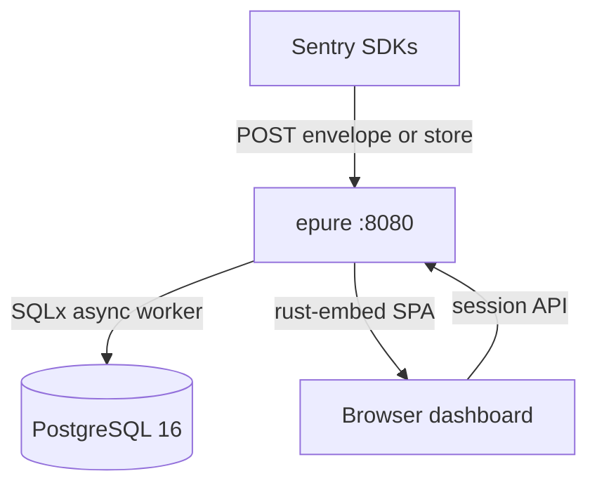
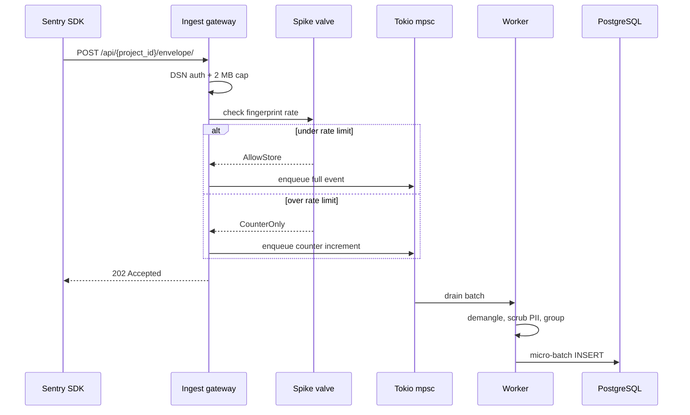
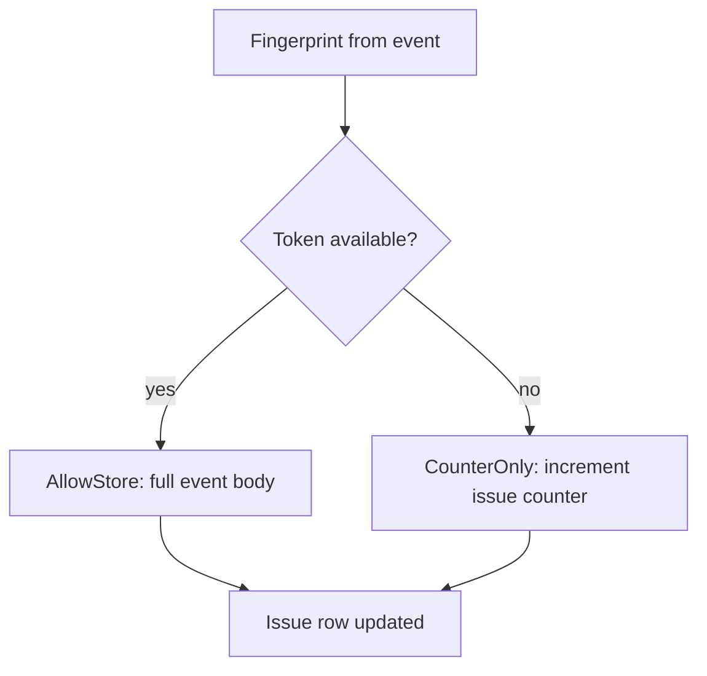

# Architecture

How epure is built: two containers, one Rust binary, PostgreSQL 16 with row-level security. This page covers the ingest path, spike valve, storage model, and deploy topology. For install steps, see [QUICKSTART.md](./QUICKSTART.md). For production overlays, see [SELF_HOST.md](./SELF_HOST.md).

**Measured on 2026-09-12** (M-series Mac, Docker Desktop): idle stack **~82 MiB** (epure 22.7 MiB + postgres 59.3 MiB). Release binary **18.1 MiB** inside the container. No Redis, Kafka, or external object store on the core path.

---

## Deploy topology

Two containers. The Rust binary serves ingest, dashboard APIs, and the embedded SPA on one port. PostgreSQL holds all tenant data with RLS enforced on dashboard reads.



**Plain text:** SDKs POST to `epure` on port 8080. The same process accepts ingest, runs the worker pipeline, and serves the embedded React dashboard. All persistence goes to PostgreSQL 16. No separate worker container, no Redis queue, no Nginx sidecar.

| Service | Port | Role |
|---|---|---|
| `epure` | `8080` | Rust binary (`--mode=all`) + embedded dashboard SPA |
| `postgres` | `5433` → `5432` | PostgreSQL 16 with RLS, partitioned events, session store |

Phase 1 runs a single artifact: ingest gateway, processing worker, management API, and static UI assets compiled into one binary via `rust-embed`. Compose file: [`docker-compose.yml`](../docker-compose.yml). Production overlay: [`docker-compose.prod.yml`](../docker-compose.prod.yml).

---

## Ingest flow

Ingest is asynchronous. The HTTP handler validates the DSN, applies the spike valve, enqueues work on a Tokio `mpsc` channel, and returns **202 Accepted** before demangling, scrubbing, or grouping run. Body size is capped at **2 MB**.



**Plain text:** SDK sends an envelope or legacy store payload. The gateway checks the DSN key (constant-time lookup), extracts a fingerprint, and asks the spike valve whether to store the full event body or only bump the issue counter. Either way, the client gets 202 immediately. A background worker drains the queue, demangles JS/TS frames when sourcemaps exist, scrubs PII with regex rules, groups events into issues by fingerprint, and writes to Postgres in micro-batches (up to 500 events or 500 ms, whichever comes first).

Supported wire paths:

| Endpoint | Format |
|---|---|
| `POST /api/{project_id}/envelope/` | Sentry envelope (primary) |
| `POST /api/{project_id}/store/` | Legacy JSON store (Python and older SDKs) |

Transactions, replay, profiling, and session payloads are discarded if the SDK sends them. Phase 1 is exception-only. See [COMPATIBILITY.md](./COMPATIBILITY.md) for the full matrix.

Source code entry points: [`crates/server/src/routes/ingest.rs`](../crates/server/src/routes/ingest.rs), [`crates/envelope/`](../crates/envelope/), [`crates/demangle/`](../crates/demangle/).

---

## Spike valve

Runaway loops can hammer any error tracker with identical events. epure's spike valve is an in-memory token bucket keyed by **fingerprint**. When a fingerprint exceeds its rate, epure still counts the event toward the issue but does not persist duplicate bodies.



**Plain text:** Each fingerprint gets a token bucket (default **100 events per minute**, refilling continuously). Under the limit, the worker stores the full event — stack, breadcrumbs, context. Over the limit, the gateway returns 202 and the worker increments `event_count` on the existing issue without writing another row to the events partition. You still see the spike in triage; you do not fill Postgres with ten thousand copies of the same exception.

This is loop protection, not sampling. Every accepted request gets a 202. The valve protects storage and query performance during incident floods — the same class of problem that makes per-event billing painful on other platforms.

Per-project ingest caps (default **5000 events/hour**) are a separate gate applied before enqueue. Revoked DSN keys return **403**. Implementation: [`crates/server/src/pipeline/spike.rs`](../crates/server/src/pipeline/spike.rs).

---

## Storage and tenancy

PostgreSQL 16 is the only database. epure uses two isolation mechanisms depending on the request path.

### Row-level security (RLS)

Dashboard and management APIs run queries inside a transaction with `app.current_org_id` set from the logged-in session. RLS policies on tenant tables (`issues`, `events`, `projects`, `alerts`, and related rows) filter reads and writes to the current organization. Ingest does not use session context — it resolves the project from the DSN and writes with project scope directly.

Sessions are stored in Postgres (`tower-sessions`), cookies are `HttpOnly` with the `__Host-` prefix, and passwords use **argon2id**. Google OAuth is optional when `GOOGLE_CLIENT_ID` is configured.

### Partitions and TTL

Raw events land in monthly partitions named `events_YYYY_MM`. A background job creates upcoming partitions and drops expired ones based on per-project retention (14, 30, or 90 days). Dropping a partition removes event bodies; issue aggregates (`event_count`, `last_seen`, status) are preserved so triage history stays intact.

Unique-user counts and release metadata follow the same Postgres path — no separate analytics store.

Migrations: [`crates/storage/migrations/`](../crates/storage/migrations/). RLS helpers: [`crates/storage/src/rls.rs`](../crates/storage/src/rls.rs). TTL job: [`crates/server/src/jobs/ttl.rs`](../crates/server/src/jobs/ttl.rs).

---

## Crate layout

```text
crates/
├── envelope/     # Parse envelope + store; PII scrub; fingerprint extraction
├── demangle/     # JS/TS sourcemap resolution
├── storage/      # SQLx queries, RLS, partitions, migrations
├── auth/         # Sessions, DSN keys, Google OAuth, argon2id
└── server/       # Axum routes, ingest pipeline, lifecycle jobs, embed SPA

web/              # React 19 + Vite → rust-embed into the binary
fixtures/sentry/  # Real SDK envelope dumps for integration tests
```

The UI is a client-rendered SPA (React 19, Vite, Radix, Tailwind v4). No SSR. Assets ship inside the Rust binary — no Node runtime in the product container.

---

## What Phase 1 excludes

| Not in OSS Phase 1 | Notes |
|---|---|
| Redis / Kafka / NATS | Tokio `mpsc` only |
| Split ingress/worker modes | `--mode=all` in compose |
| Tracing, replay, profiling, sessions | Discarded at ingest |
| iOS / Android symbolication | Raw frames only |
| ClickHouse / external object store | Postgres + local volume for artifacts |

Phase 2 Cloud may split binary modes and add optional Redis Streams — that path is not part of the self-host compose.

---

## Further reading

- [QUICKSTART.md](./QUICKSTART.md) — golden path with time budgets
- [SELF_HOST.md](./SELF_HOST.md) — production checklist, env vars, backups
- [COMPATIBILITY.md](./COMPATIBILITY.md) — SDK matrix and protocol subset
- [DATA.md](../DATA.md) — PII scrub, RBAC, operator data handling
- [ingest.openapi.yaml](./ingest.openapi.yaml) — ingest wire contract
