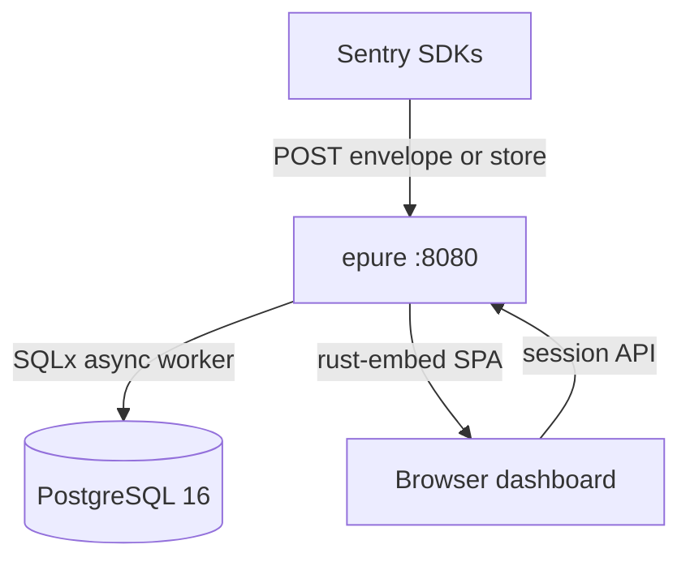
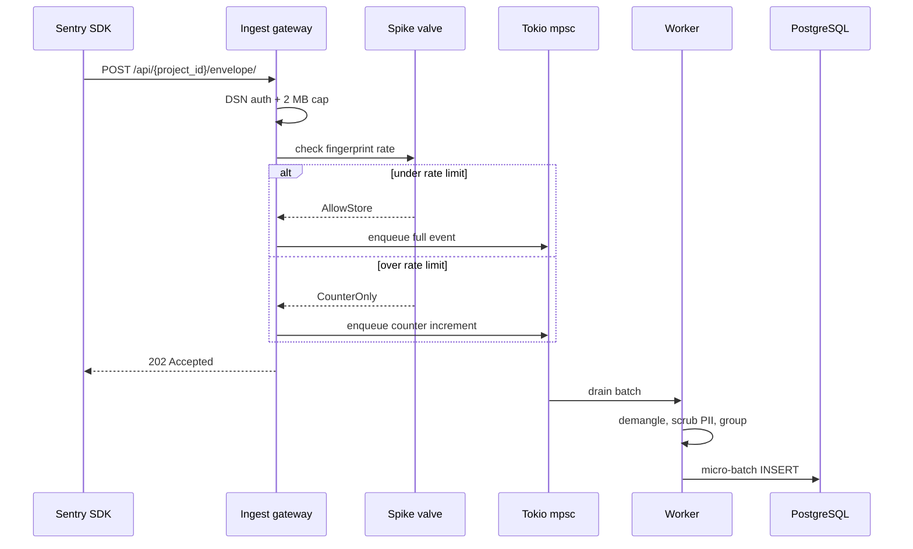
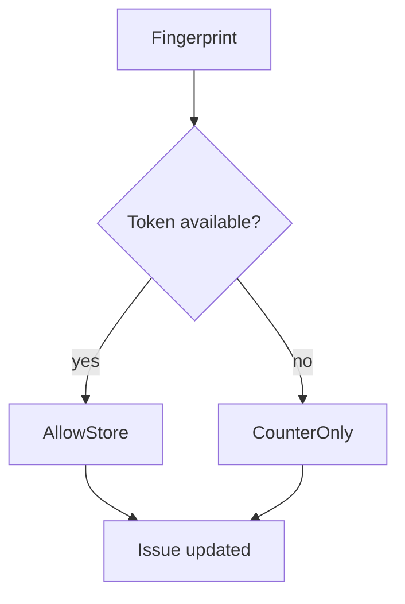

# Architecture

Two containers. One Rust binary. PostgreSQL 16 with RLS. Install: [QUICKSTART.md](./QUICKSTART.md) · Prod: [SELF_HOST.md](./SELF_HOST.md).

**2026-09-12** (Docker Desktop): idle **~82 MiB** (Epure 22.7 + Postgres 59.3). Binary **18.1 MiB**. No Redis / Kafka on the path.

## Topology



**Plain text:** SDKs and the dashboard hit the same `epure` process on 8080. Persistence is Postgres only. No separate worker container.

| Service | Port | Role |
|---|---|---|
| `epure` | `8080` | Ingest + APIs + embedded SPA (`--mode=all`) |
| `postgres` | host `5433` → `5432` | RLS, partitions, sessions |

Compose: [`docker-compose.yml`](../docker-compose.yml) · prod overlay: [`docker-compose.prod.yml`](../docker-compose.prod.yml).

## Ingest

DSN auth → spike valve → Tokio `mpsc` → **202** → worker demangles / scrubs / groups → micro-batch write (≤500 events or 500 ms). Body max **2 MB**.



Wire: `POST .../envelope/` (primary) · `POST .../store/` (legacy). Transactions / replay / profiles discarded. [COMPATIBILITY.md](./COMPATIBILITY.md).

Code: [`crates/server/src/routes/ingest.rs`](../crates/server/src/routes/ingest.rs) · [`crates/envelope/`](../crates/envelope/) · [`crates/demangle/`](../crates/demangle/).

## Spike valve

In-memory token bucket per **fingerprint** (default **100/min**). Over limit: still **202**, bump `event_count`, skip duplicate bodies. Separate gate: **5000 events/hour** per project. Revoked DSN → **403**. Impl: [`crates/server/src/pipeline/spike.rs`](../crates/server/src/pipeline/spike.rs).



## Storage

- **RLS:** dashboard sets `app.current_org_id` per session. Ingest resolves project from DSN.
- **Partitions:** `events_YYYY_MM` · TTL 14 / 30 / 90 days · issue aggregates survive.
- **Auth:** Postgres sessions, argon2id, optional Google OAuth.

Migrations: [`crates/storage/migrations/`](../crates/storage/migrations/). TTL: [`crates/server/src/jobs/ttl.rs`](../crates/server/src/jobs/ttl.rs).

## Crates

```text
crates/envelope/   parse, scrub, fingerprint
crates/demangle/   JS/TS sourcemaps
crates/storage/    SQLx, RLS, partitions
crates/auth/       sessions, DSN, OAuth
crates/server/     Axum, pipeline, embed SPA
web/               React 19 + Vite → rust-embed
fixtures/sentry/   real SDK dumps
```

No Node in the product container. No SSR.

## Not in Phase 1

Redis / Kafka · split ingress/worker modes · tracing / replay / profiling · iOS/Android symbolication · ClickHouse.

## Further reading

[QUICKSTART](./QUICKSTART.md) · [SELF_HOST](./SELF_HOST.md) · [COMPATIBILITY](./COMPATIBILITY.md) · [DATA.md](../DATA.md) · [ingest.openapi.yaml](./ingest.openapi.yaml)
