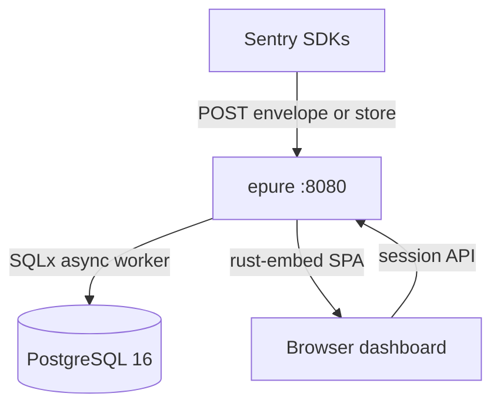

<p align="center">
  
</p>

<p align="center">
  <a href="LICENSE"></a>
  <a href="https://www.rust-lang.org/"></a>
  <a href="https://www.postgresql.org/"></a>
  <a href="docker-compose.yml"></a>
  <a href="https://github.com/epure-sh/epure/actions/workflows/ci.yml"></a>
</p>

# Epure

[Epure](https://epure.sh) is exception-only error monitoring for self-hosters. Keep your official Sentry SDKs. Change the DSN. When production throws, you get a grouped issue and a stack you can read.

- [x] Official Sentry SDK ingest (envelope + store). [Docs](https://epure.sh/docs/platforms)
- [x] Grouped issues, breadcrumbs, JS/TS sourcemaps. [Quickstart](https://epure.sh/docs/get-started/quickstart)
- [x] Spike valve for infinite loops. [Concepts](https://epure.sh/docs/get-started/concepts)
- [x] Keyboard triage (`j` / `k` / `e` / `i`) + Markdown export for LLMs
- [x] Alerts, webhooks, releases, regressions
- [x] Multi-project orgs, DSN rotate/revoke, RBAC
- [x] Two containers: Rust binary + PostgreSQL 16 with RLS. [Self-host](https://epure.sh/docs/self-hosting/installation)
- [x] Dashboard


**2 containers** · **~82 MiB** idle · **~9 s** to first issue · measured 2026-09-12 on Docker Desktop (re-verify on your hardware).

Watch "releases" of this repo to get notified of major updates.

## Documentation

Full documentation: **[epure.sh/docs](https://epure.sh/docs)**

- [Quickstart](https://epure.sh/docs/get-started/quickstart) — first issue on a laptop
- [Self-hosting](https://epure.sh/docs/self-hosting/installation) — production install, TLS, backups
- [Configuration](https://epure.sh/docs/self-hosting/configuration) — env vars and overlays
- [Platforms](https://epure.sh/docs/platforms) — SDK matrix and honest gaps
- [Concepts](https://epure.sh/docs/get-started/concepts) — DSN, issue, spike valve
- [Ingest API](https://epure.sh/docs/api) — envelope / store reference
- [Contributing](CONTRIBUTING.md) — build, test, PR

Website: [epure.sh](https://epure.sh) · Self-host landing: [epure.sh/selfhost](https://epure.sh/selfhost)

## Community & Support

- [GitHub Discussions](https://github.com/epure-sh/epure/discussions). Best for: setup questions and DSN wiring.
- [GitHub Issues](https://github.com/epure-sh/epure/issues). Best for: bugs and SDK / protocol gaps (use a template).
- [SECURITY.md](SECURITY.md). Best for: vulnerabilities · `security@news.epure.sh`
- Email support · `support@news.epure.sh`. Best for: Cloud / commercial questions.
- [CODE_OF_CONDUCT.md](CODE_OF_CONDUCT.md). Conduct · `conduct@news.epure.sh`

## Get started

Docker Compose v2. No `.env` file. No configure step.

```bash
git clone https://github.com/epure-sh/epure.git && cd epure
docker compose up
curl -sS http://localhost:8080/health   # → {"status":"ok"}
```

Open [http://localhost:8080](http://localhost:8080) → register → name a project → copy the DSN → point your SDK.

<details>
<summary>Port 8080 taken, demo data, or production VPS</summary>

**Another port** — copy `.env.example`, set `EPURE_PORT` (public URL follows on localhost), recreate `epure`:

```bash
cp .env.example .env   # edit EPURE_PORT=3000
docker compose up
```

Or `./configure --quick` to auto-pick a free port.

**Demo seed + Vite CORS** — uncomment `EPURE_DEV_SEED=1` and `EPURE_CORS_ORIGINS` in `.env`, or `./configure --dev`.

**Production** — `./configure --prod` or `.env.production.example` + [installation guide](https://epure.sh/docs/self-hosting/installation). Full env reference: [Configuration](https://epure.sh/docs/self-hosting/configuration).

</details>

```javascript
import * as Sentry from "@sentry/browser";

Sentry.init({
  dsn: "http://{public_key}@localhost:8080/{project_id}",
  tracesSampleRate: 0,
  replaysSessionSampleRate: 0,
  replaysOnErrorSampleRate: 0,
  profilesSampleRate: 0,
});
```

No `@epure/*` package. Zero the extra product lines so transactions, replay, and profiles are discarded without surprise. Walkthrough: [epure.sh/docs/get-started/quickstart](https://epure.sh/docs/get-started/quickstart). Production: [epure.sh/docs/self-hosting/installation](https://epure.sh/docs/self-hosting/installation).

<details>
<summary>Dev seed (skip register) — ⚠️ DEV ONLY</summary>

```bash
./scripts/seed-dev.sh
# login: dev@epure.local / devpassword
```

</details>

## How it works

Epure is a small stack for one job: production exceptions → grouped issues → calm triage. It is not a 1-to-1 mapping of Sentry. If the SDK sends transactions, replay, or profiles, the HTTP request is accepted and those items are dropped.

### Architecture

Self-host with [Docker Compose](docker-compose.yml) (two containers). You can also use [managed hosting](https://epure.sh).



**Plain text:** SDKs and the dashboard hit the same Rust process. Host port is `EPURE_PORT` (default **8080**); the process still binds `8080` inside the container. Persistence is PostgreSQL 16 only. No Redis. No Kafka. No separate worker container.

| Service | Port | Role |
|---|---|---|
| `epure` | host `EPURE_PORT` (default `8080`) → `8080` | Ingest + APIs + embedded SPA (`--mode=all`) |
| `postgres` | host `POSTGRES_HOST_PORT` (default `5433`) → `5432` | RLS, monthly event partitions, sessions |

- **[Ingest gateway](https://epure.sh/docs/api/envelope)** — DSN auth, 2 MB body cap, spike valve, Tokio `mpsc`, returns **202** before persist.
- **Spike valve** — per-fingerprint token bucket (~100/min). Over limit: counter bumps, duplicate bodies drop. Separate project cap: **5000 events/hour**.
- **Worker** — demangle JS/TS sourcemaps, scrub PII, group by fingerprint, micro-batch INSERT.
- **[PostgreSQL 16](https://www.postgresql.org/)** — issues, events, releases, sessions. Dashboard queries use RLS (`app.current_org_id`).
- **Dashboard** — React SPA embedded via `rust-embed`. Keyboard-first Issues UI.

Ingest path (plain text): SDK → DSN check → spike valve → enqueue → **202** → worker demangle/scrub/group → Postgres.

### SDK clients

Keep the official Sentry clients. Epure is the destination.

| Language | Status | Notes |
|---|---|---|
| Browser (`@sentry/browser` 7.x) | E2E in CI | Sourcemaps demangle |
| Python (store) | E2E in CI | Raw frames |
| Node (`@sentry/node` 7.x) | Parse + fixture | Sourcemaps demangle |
| Go, Ruby, PHP, Java, .NET | Fixture captured | Raw frames |

Full matrix and init snippets: [epure.sh/docs/platforms](https://epure.sh/docs/platforms). Wire contract in-repo: [docs/ingest.openapi.yaml](docs/ingest.openapi.yaml).

### Out of scope (Phase 1)

Distributed tracing · session replay · continuous profiling · generic log ingest · iOS/Android symbolication · Redis / Kafka / ClickHouse on the path.

<details>
<summary>How Epure compares</summary>

Measured Epure figures from this repo (2026-09-12). Competitor figures from their documentation as of 2026-09. Re-verify before you rely on them.

| | **Epure** | **Sentry self-host** | **GlitchTip** |
|---|---|---|---|
| **Containers** | 2 | 20+ ([docs](https://develop.sentry.dev/self-hosted/)) | 4+ ([install](https://glitchtip.com/documentation/install)) |
| **RAM** | **~82 MiB** idle (measured) | 16 GB + swap ([guide](https://develop.sentry.dev/self-hosted/)) | 512 MB rec / 256 MB min |
| **SDK path** | Change DSN | Change DSN | Change DSN |
| **License** | Apache 2.0 | BSL / SaaS | MIT |

If GlitchTip is already quiet for you, stay there.

</details>

---

**Apache 2.0** · no `ee/` split · [CHANGELOG](CHANGELOG.md) · [CONTRIBUTING](CONTRIBUTING.md)

**Managed hosting:** Epure Cloud — Pro $24/mo · Plus $79/mo. Flat pricing, no per-event overage. [epure.sh](https://epure.sh)
