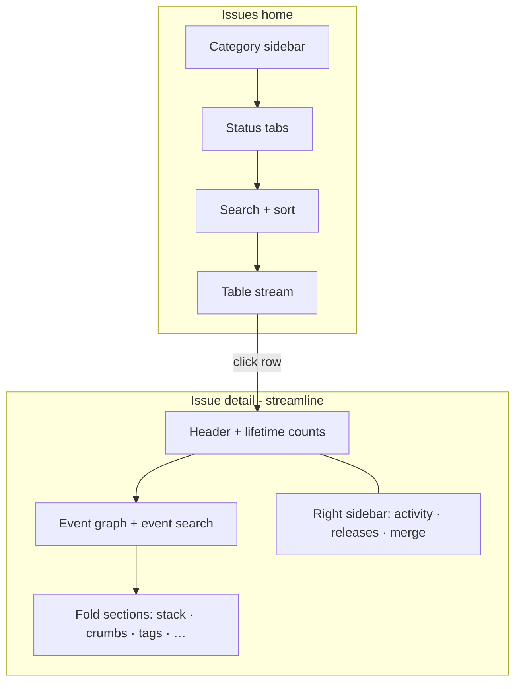
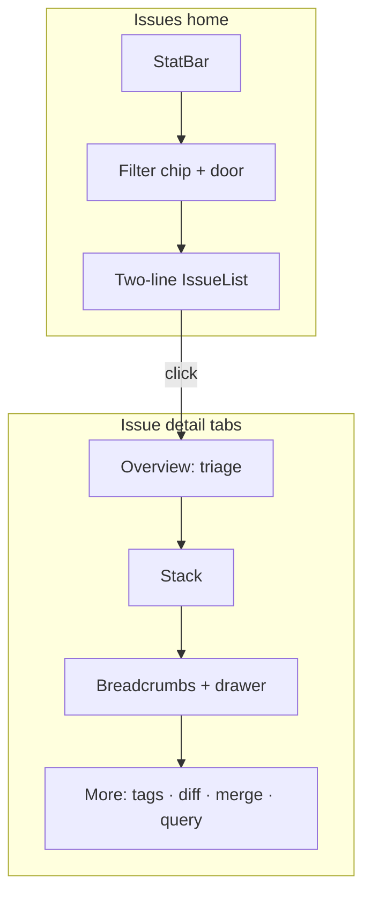

# Sentry IA borrow — issue list & issue detail

**Status:** Research dossier (2026-09-12)  
**Inputs:** Sentry product docs, 2024–2025 issue-stream + issue-details redesign (GitHub), Epure `002-dashboard-ux/charter.md`  
**Scope:** Error issues only. **Out of scope:** replay, APM, profiling, performance-issue categories, trace/span UI.

---

## Executive summary

Sentry’s issues experience is a **query-first triage console**: saved views, status tabs, sort modes, and a wide issue stream table optimized for teams who already speak `is:unresolved`. The issue detail page (2024 “streamline” redesign) **abandoned tabs for a long scroll** with foldable sections, jump links, event-level search, and a collapsible right sidebar for issue-level metadata and activity.

For Epure, **borrow the data model and frame presentation**, not the chrome hierarchy:

| Sentry pattern | Epure stance |
|----------------|--------------|
| Issue stream table + row density | **Steal** — adapted as a calm two-line list, not a 7-column table |
| Stack frames (in-app highlight, vendor collapse) | **Steal** — on Stack tab |
| Breadcrumb timeline + deep search | **Steal structure** — preview on Breadcrumbs tab; search in drawer/panel |
| Tags (event vs issue scope) | **Steal concept** — env/release/user on Overview; full tags in More |
| Status tabs + query bar as hero | **Hide from P1** — plain “Unresolved” home + Filter door |
| Event graph + event search on detail | **Hide from P1** — optional in More for P3 |
| Right sidebar (activity, assignees, viewers) | **Defer / More** — Resolve/Ignore stay on Overview |
| Replay, trace, profiling sections | **Refuse** — constitution |

Target Epure IA (from charter): **Overview · Stack · Breadcrumbs · More** tabs — simpler than Sentry’s scroll-all-at-once, better for J3 one-screen triage.

---

## 1. Issue list — Sentry structure

### 1.1 Page-level chrome (above the stream)

Sentry’s Issues home stacks **four layers** before you reach a row:

1. **Category rail** (left): Errors & Outages, Breached Metrics, Warnings, Configuration, User Feedback — Epure Phase 1 is **errors only**; skip entire category dimension.
2. **Status tabs**: `All Unresolved`, `For Review`, `Regressed`, `Archived`, `Escalating` — each is a saved filter (`is:unresolved`, etc.).
3. **Search + sort bar**: free-text query with Sentry search syntax; sort dropdown (Recommended, Last Seen, First Seen, Trends, Events, Users).
4. **Saved views / Issue Views**: named combinations of query + sort + project/env/time — shareable org-wide.

**Noise for P1:** tabs named with query tokens, sort modes beyond “most recent”, saved-view management, category sidebar.  
**Keep for P3:** equivalent power lives in Epure **Filter** panel + optional query syntax; saved views can wait.

### 1.2 Stream layout — table, not cards

Modern Sentry (issue-stream-table-layout, 2024) renders issues as a **responsive table** with explicit columns:

| Column | Content | Responsive priority |
|--------|---------|---------------------|
| **Issue** (flex) | Title, error message, project, type, location | Always visible |
| **Priority** | High / medium / low badge | Hides 2nd |
| **Events** | Lifetime or filtered event count | Hides 3rd |
| **Users** | Distinct users affected | Hides 3rd (with Events) |
| **Trend** | Sparkline of volume over time | Hides 4th |
| **Assignee** | Avatar / unassigned | Hides last |
| **Last seen** | Relative timestamp | Hides 1st |
| **Age** | Time since first seen | Hides 1st (with Last seen) |

**Column collapse order** (narrow viewports): Last seen & Age → Priority → Events & Users → Trend → Assignee. Sentry **does not** horizontal-scroll hidden columns on mobile — it drops them.

**Row anatomy (2024 title redesign):**

```
Row 1:  **Title**  Error message (truncated)
Row 2:  project · error_type · location · …   (all muted gray)
Left:   Colored level square (error / warning / fatal / …)
Hover:  Stack trace preview on title hover
```

**What helps comprehension**

- **Two-line row**: primary line = human title + message; secondary = context chips — maps cleanly to Epure `IssueRow` title + meta.
- **Level indicator**: small, scannable severity — Epure already uses unread border + level badge on detail; list can add subtle level dot.
- **Last seen** as primary temporal signal — more actionable than “age” for P1.

**What adds noise for P1**

- Priority column (Sentry ML/heuristic — opaque to newcomers).
- Trend sparkline (implies analytics literacy).
- Assignee (solo dev default).
- Separate Events vs Users columns (merge to one plain phrase: “12 events”).
- Hover stack preview (magic for experts, invisible affordance for P1).

**P3 behind Filter / column prefs (future)**

- Sort by events, users, trends.
- Optional columns: environment, release, assignee, custom tags.
- Saved filtered views.

### 1.3 Density & interaction

- Row height: compact (~36–44px effective with two text lines) — aligns with Epure `--row-height` (36px); charter allows **two-line meta** within that band.
- **Bulk triage**: checkbox selection, bulk resolve/archive — Epure has select mode + bulk actions (P3).
- **Keyboard**: Sentry supports navigation shortcuts; Epure has `j/k/e/i/x//` — keep discoverable via `?` / palette, **not** permanent header strip (charter anti-pattern).

### 1.4 Map to Epure Issues home

```
┌ Stat bar ─────────────────────────────────────────┐
│ Unresolved · Events (7d) · Regressions           │
├ Filter chip row ──────────────── [ Filter ] ──────┤
│ Unresolved (default) · optional chips              │
├ Issue list (master pane) ─────────────────────────┤
│ ● Title                              last seen     │
│   level · N events · env · release               │
└───────────────────────────────────────────────────┘
```

**Steal:** two-line row, last-seen emphasis, level as secondary signal.  
**Hide:** query string as default label, 7-column table, trend graph, priority, assignee.  
**Filter door:** status variants (regressed, ignored), sort, query syntax, tag filters.

---

## 2. Issue detail — Sentry structure

Sentry has **two generations** of detail IA:

| Era | Navigation model | Default for new users (2025) |
|-----|------------------|------------------------------|
| **Classic** | Tabs + dense header | Legacy opt-out |
| **Streamline** (2024+, GA opt-in Jan 2025) | **Single scroll** + fold sections + jump nav + collapsible sidebar | Becoming default |

Epure charter explicitly chooses **tabs** — a deliberate simplification for P1 (J3: resolve without scrolling past advanced panels). Borrow Sentry **section content**, not their scroll-first shell.

### 2.1 Header zone (issue-level)

Sentry header always shows:

- **Issue title** = grouped error message / exception type
- **Lifetime counts**: total events, users affected (header totals ≠ filtered counts below)
- **Primary actions**: Resolve, Archive, Assign, Share, Subscribe (bell)
- **Error level** icon + type line under title

**Steal for Epure Overview tab**

- Title + status badge + level
- One line: event count + last seen (+ environment if set)
- **Resolve / Ignore** primary actions visible without scroll (J3)

**Hide from Overview (move to More or omit Phase 1)**

- Share link variants, subscribe bell (Alerts rail covers notifications)
- Assignee / participants / viewers
- Lifetime vs filtered count split (requires event search UI)

### 2.2 Event selector band (event-level)

Below the header, Sentry places an **event investigation strip**:

- **Event volume graph** (toggle events vs users; release markers; feature-flag annotations)
- **Embedded event search** — filter events by properties; updates graph, counts, and navigator
- **Tag previews** — top tags for filtered set; link to full tags
- **Event navigator**: Recommended (default) · Latest · Oldest · All events · prev/next chronological

Recommended event picks recency + search relevance + “debugging tools present” (replay, profiles, traces) — last criterion **irrelevant for Epure**.

**Steal (lightly, P2/P3)**

- Occurrence picker: “latest / pick from list” — Epure already has occurrence buttons in `event-detail.tsx`
- Recommended = latest in-app frame with breadcrumbs (simple heuristic)

**Hide from P1 default surface**

- Event graph on detail (Plausible-shaped home already has stat bar)
- Event search bar (query syntax) → **More** tab or Filter-style drawer
- Release markers on graph

### 2.3 Main content — scroll sections (Sentry streamline)

Foldable sections in typical order (error issues):

| Section | Scope | Sentry behavior | Epure tab |
|---------|-------|-----------------|-----------|
| Event highlights | Event | Promoted tags/context at top; later moved under stack | Overview (top 3 tags only) |
| Stack trace | Event | In-app frames emphasized; vendor collapsed; suspect commits | **Stack** |
| Breadcrumbs | Event | Inline preview + **View All** slide-out (Aug 2024); filter/sort/search in drawer | **Breadcrumbs** |
| Tags | Event (main) + Issue aggregate (sidebar) | Category tabs: All / Custom / Application / Other | **More** |
| Contexts | Event | Key/value blobs; not searchable | **More** |
| HTTP request | Event | Query, cookies, headers | **More** (if present) |
| Packages | Event | Dependency versions | **More** |
| Grouping info | Event | Fingerprint explanation | **More** (P3 merge/split context) |
| Attachments / screenshots | Event | Media | **More** if Phase 1 ships attachments |
| ~~Replay~~ | — | **Forbidden** | — |
| ~~Trace preview / spans~~ | — | **Forbidden** | — |
| ~~Profiling~~ | — | **Forbidden** | — |

**Stack / breadcrumbs / tags placement lesson**

Sentry’s 2024 breadcrumb redesign is the best borrow:

- **Never nest a scroll inside the main scroll** — preview ~5–10 crumbs, then drawer for deep inspection.
- **Stack is the hero debug surface** — above breadcrumbs in priority.
- **Tags split by scope**: event tags answer “this occurrence”; sidebar/issue tags answer “all occurrences” — Epure can show env/release/user on Overview and defer tag explorer to More.

### 2.4 Right sidebar (issue-level)

Collapsible panel with:

- First seen / last seen (env-filtered)
- First / last release
- Linked GitHub/Jira issues
- **Activity feed** + comments
- Participants & viewers (hover timestamps)
- Similar issues / merged issues
- Seer AI suggestions

**Epure mapping**

| Sidebar block | P1 | P3 / More |
|---------------|-----|-----------|
| First/last seen | Overview (one line) | Full timestamps |
| Releases | Overview chip | Release diff (existing `DiffPanel`) |
| Activity | Omit or minimal | More tab |
| Comments | Phase 2? | — |
| Merge/similar | Hidden | MergeActions + More |
| AI | Refuse Phase 1 | — |

### 2.5 Tabs vs scroll — decision for Epure

| Approach | Pros | Cons |
|----------|------|------|
| **Sentry streamline scroll** | Power users see everything; jump links; section collapse | Overwhelms P1; violates J3; encourages query-first detail page |
| **Epure tabs (charter)** | Overview fits one screen; plain labels; progressive depth | Extra click to stack; must not duplicate content across tabs |

**Recommendation:** tabs for shell; **within Stack/Breadcrumbs**, use Sentry’s fold + drawer patterns.

---

## 3. Persona matrix — steal / hide / defer

### P1 — Plausible-shaped builder (never used Sentry)

| Element | Action |
|---------|--------|
| Grouped issue list with title + last seen | **Show** |
| Plain “Unresolved” default | **Show** |
| Resolve / Ignore on Overview | **Show** |
| Stack tab with highlighted in-app frame | **Show** |
| Breadcrumb preview (no regex box visible) | **Show** on Breadcrumbs tab |
| env / release on Overview | **Show** when present |
| Query bar, `is:unresolved` chips as hero | **Hide** → Filter |
| Status tabs (For Review, Escalating, …) | **Hide** → Filter presets |
| Sort modes, trend sparklines | **Hide** |
| Event graph on detail | **Hide** |
| Keyboard cheat sheet in header | **Hide** → `?` |
| Diff, merge, export | **Hide** → More / shortcuts |

### P2 — Sentry migrant

| Element | Action |
|---------|--------|
| Issue / event vocabulary | **Show** (same words: issue, resolve, ignore) |
| Stack + breadcrumbs layout | **Show** (familiar placement) |
| Occurrence switching | **Show** |
| Query syntax | **Available** in Filter, not required |
| Pixel parity, assignee, priority | **Do not chase** |
| Saved views | Nice-to-have later |

### P3 — Daily triager

| Element | Action |
|---------|--------|
| Filter + query syntax | **Show** (001 proofs) |
| `j/k`, merge, split, diff, export | **Show** |
| Breadcrumb regex / category filters | **Show** on Breadcrumbs |
| Event list / diff across occurrences | **Show** in More |
| Grouping info, bulk actions | **Show** |
| Optional column density / sort | **Filter / settings** |
| Sentry-style event search on detail | **More** tab advanced |

---

## 4. Map to Epure components (002 target)

| Sentry surface | Epure component / route |
|----------------|-------------------------|
| Issue stream row | `IssueRow` + `IssueList` |
| Stat counts above stream | `StatBar` (new) |
| Query + saved filters | `FilterPanel` + `FilterRow` (query hidden default) |
| Detail header + actions | Overview tab header in `IssueDetailTabs` |
| Occurrence picker | Slim bar on Overview; full list in More |
| Stack frames | `CodeBlock` on Stack tab |
| Breadcrumbs preview + drawer | Breadcrumbs tab + `BreadcrumbDrawer` |
| Tags / contexts / HTTP | More tab sections |
| Merge / diff | `MergeActions`, `DiffPanel` → More or select mode |
| Export | Keep shortcut; entry in More menu |

---

## 5. Sentry IA diagram (reference)



Epure trimmed graph:



---

## 6. Sources

- [Sentry Issues product docs](https://docs.sentry.io/product/issues/)
- [Sentry Issue Details docs](https://docs.sentry.io/product/issues/issue-details/)
- [Issue stream table layout PR #78884](https://github.com/getsentry/sentry/pull/78884)
- [Issue stream two-row title PR #78981](https://github.com/getsentry/sentry/pull/78981)
- [Issue details streamline discussion #80801](https://github.com/getsentry/sentry/discussions/80801)
- [Breadcrumbs UI changelog Aug 2024](https://sentry.io/changelog/improved-breadcrumbs-on-issues/)
- Epure `specs/002-dashboard-ux/charter.md`, `journeys.md`

---

## Principles

1. **Borrow the object model, not the console chrome** — issues, occurrences, stack, breadcrumbs are universal; query bars and seven-column tables are Sentry muscle memory.
2. **Issue-level vs event-level clarity** — anything that varies per occurrence (stack, crumbs, request) belongs off Overview; lifetime counts and status stay issue-level.
3. **Two-line list density is the sweet spot** — title + message on line one, muted context on line two; resist table columns until P3 needs them.
4. **Stack before breadcrumbs before tags** — matches debug urgency; tags are filter keys, not the first read.
5. **Depth through doors** — Filter for list power; More tab for detail power; tabs beat infinite scroll for first-time comprehension.
6. **Plain words default, syntax optional** — “Unresolved” not `is:unresolved`; query syntax validates P3 without blocking P1.
7. **No forbidden observability UI** — no replay, trace, profiling, performance categories, or Seer panels in Phase 1 IA.

---

## Anti-patterns

1. **Query bar as the hero of Issues home** — Sentry’s default; fails J2 five-second scan for P1.
2. **Permanent keyboard legend in detail header** — current Epure `index.tsx` pattern; charter refuses; use `?` / palette.
3. **Single long scroll for all detail sections** — Sentry streamline ok for experts; fails J3 one-screen triage.
4. **Nested scroll regions** — Sentry fixed this for breadcrumbs (2024); do not regress in Epure.
5. **Showing diff/merge/export before Stack tab** — power chrome visible by default intimidates P1/P2.
6. **Mirroring Sentry priority / recommended sort** — opaque heuristics; default to last seen.
7. **Custom column picker before core journeys pass** — Sentry still lacks it; Epure should nail J1–J3 first.
8. **Importing category sidebar (Errors vs Performance vs …)** — scope creep beyond exception-only charter.
9. **Event graph on detail as default** — duplicates stat bar; adds analytics framing Plausible philosophy rejects.
10. **Chasing hover stack preview on list rows** — invisible to touch users and P1; click-through is enough.

---

## Candidate patterns for Epure

### Issues home

- **StatBar**: unresolved count · events (7d) · regressions — Plausible top strip, Sentry aggregate intent without graph chrome.
- **Default filter**: plain “Unresolved” chip; Filter door exposes regressed/ignored/level/release/query.
- **IssueRow v2**: line1 `title` (+ truncate message if distinct); line2 `{level} · {n} events · {env} · {release}`; right-aligned relative last seen; optional level dot instead of Sentry’s left square.
- **Select mode**: hidden until `x` or bulk intent — exposes merge/bulk bar (P3).
- **No table header row** in v1 — columns implied by row layout; add header only when column picker ships.

### Issue detail tabs

- **Overview**: title, status, level, env/release, last seen, event count, Resolve/Ignore/Snooze, top 3 tags max, latest occurrence one-liner; **no** diff, merge, export buttons in header for P1 — tuck Export under More or overflow.
- **Stack**: `CodeBlock` with in-app frame highlight; collapse vendor frames; link to source file if symbolicated.
- **Breadcrumbs**: last N entries inline; “View all” opens drawer with category filters + search (P3 regex inside drawer).
- **More**: all tags (grouped), contexts, HTTP, grouping info, occurrence list, diff panel, merge/split, event query, export markdown.

### Progressive disclosure mechanics

- **Filter panel** (list): chips + optional syntax textarea; saved presets as named chips later — not Issue Views sidebar.
- **Overflow / More menu** (detail): houses P3 actions without tab proliferation.
- **Command palette**: `�Cmd+K` for jump resolve/export/filter — Linear steal, not Sentry.

### Responsive

- Follow Sentry’s **drop columns, don’t horizontal-scroll** ethic on narrow panes: last seen merges into meta line; hide release until detail.

### Proof alignment

| Journey | Sentry borrow used | Sentry borrow refused |
|---------|-------------------|----------------------|
| J1 | Issue row appears after first event | Setup buried in Settings |
| J2 | Two-line list readability | Query token labels |
| J3 | Stack frame presentation | Scroll-all detail, diff visible |
| J4 | Merge, query, keyboard in Filter/More | — |

---

*Next dossier: `plausible-patterns.md` — onboarding + stat bar philosophy.*
